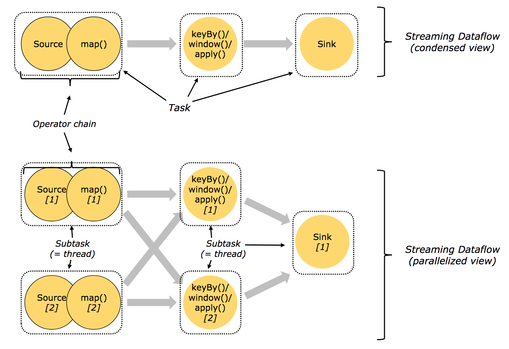

<h1> <center>flink源码剖析</center> </h1>

| 序号 |  作者  | 版本 | 修改时间  | 内容 |
| :--: | :----: | :--: | :-------: |  :-------: |
|  1   | 苗文婷 | 0.1  | 2019-06-10 | |


[TOC]

### 1. 概述

#### 1.1 功能特性

Flink是一个用于流处理和批处理的开源分布式平台，它的核心是流处理引擎（streaming dataflow engine）。

batch dataset可以视作streaming dataset的一种特例，所以Flink可通过流处理引擎同时处理batch、streaming两种类型的数据。这和spark streaming刚好相反，spark streaming是通过micro batch实现对streaming处理的支持。

-可提供准确的结果产出，即使遇到乱序数据、迟到数据；
-有状态可容错（轻量级），可以无感知地从失败中恢复并保持exactly-once的语义（也可以降级为at-least-once进一步降低消息处理延时）；
-可以大规模地运行在成千上万个节点上并保持高吞吐、低延迟，可以standalone模式运行，也可以在YARN和Mesos等资源管理平台上运行；
-灵活地支持多种基于时间、数量、会话的窗口；
-savepoint提供了状态管理机制；

Flink自上而下的全局组成结构图:


#### 1.2 编程模型

##### 1.2.1 API

Flink提供了不同层次的API用于streaming/batch应用的开发，如下图所示：


最底层的抽象仅提供状态流（stateful streaming），它通过处理函数嵌入到DataStream API中。
实践中用Core API比较多，这些流式的API提供了通用的构建入口用于数据处理，像各种用户自定义的transformation、join、aggregation、window、state等。
Table API是以表为中心的声明式DSL（领域特定语言），当这些Table表示的是stream时，Table是动态变化的。Table API遵循扩展的关系模型，提供了包括select、project、join、group-by、aggregate等操作。
Flink提供的最高层级的API是SQL，它在语义和表达能力上与Table API是类似的。

###### 1.2.1.1 DataStream API

在data stream上实现转换，如filter、update state、define windows、aggregate。DataStream中的transformation可以将一个或多个DataStream转换为一个DataStream。API参考https://ci.apache.org/projects/flink/flink-docs-release-1.4/dev/datastream_api.html。

常用的转换算子包括：

map：输入一个element产生另一个element；
flatMap：输入一个element产生0个或多个element；
filter：对一个element，仅当布尔函数返回true时保留这个element；
keyBy：按照某个指定的key的值，将一个stream划分为多个不相交的partition，一个partition中所有element的这个key的值相同；
reduce：将当前的element与最近一次生成的reduced值进行合并，然后消除这个element（reduce作用在经过keyBy的数据流上）；
fold：类似于reduce，但它是对流中的element进行折叠；
聚合算子，包括min、minBy、max、maxBy；
window：一个流被keyBy划分为若干个partition后，对各partition可以执行window，比如收集最近5分钟的数据；
window apply/reduce/fold/聚合：对一个window中的数据进行某种处理；
union：将多个流合并为一个流，这个流包含这些流的所有element；
对于stream的partition，Flink提供了自定义功能对partition过程进行定制。

我们可以把不同的算子链接到一起，使得它们在一个相同的线程中运行以获得更好的性能表现。默认情况下，Flink会尽可能地将能链接到一起的算子链接到一起。但我们可以使用类似于startNewChain()、disableChaining()进行干预。

data source：数据源可以是基于文件的、基于socket的、基于集合的，对于这些类型的数据源Flink都提供了接口可以直接从指定文件或socket或集合读入数据流。Flink也支持自定义source function，如从kafka中读取数据流。Flink支持为读取的element打上时间戳。

data sink：可以将经过各种算子处理后的数据流写到文件、csv、socket中，也可以写到自定义的sink（如kafka）。


###### 1.2.1.2 DataSet API

DataSet API在data set上实现转换，如filter、map、join、group。

DataSet API和DataStream API类似（大部分算子），少数特有的如下：

groupBy：类似于DataStream API中的keyBy；
dinstinct：返回数据集中的所有不同元素；
其它；
API参考https://ci.apache.org/projects/flink/flink-docs-release-1.4/dev/batch/index.html。


###### 1.2.1.3 Table API & SQL

Table API是一种类SQL表达式语言，可以用于关系流（relational stream）和batch，可以嵌入到DataStream API和DataSet API中。

Flink的SQL支持是基于Apache Calcite实现的，其中Apache Calcite实现了SQL标准。

Flink的Table API和SQL尚未完全实现，并非所有的功能都能支持，还在开发中。

API参考https://ci.apache.org/projects/flink/flink-docs-release-1.4/dev/table/index.html。

###### 1.2.1.4 Flink提供的库

##### 1.2.2 Flink程序与Streaming dataflow

Flink程序的基本元素包括：

stream：由连续不断的data record组成的数据流。
transformation：是一种转换操作，作用在一个或多个stream上，输出一个或多个stream。
每个Flink程序可以映射为一个streaming dataflow，这个dataflow由stream和transformation operator组成。每个dataflow是一个DAG，从一个或多个source开始，结束于一个或多个sink。

Flink程序/Streaming dataflow的结构如下图所示：


一个标准Flink程序的组成：

获取一个执行环境（StreamExecutionEnvironment用于流处理，ExecutionEnvironment用于批处理），执行环境可以决定将下面的计算放在本地jvm运行还是提交到Flink集群中运行；
加载初始数据；
在数据上指定需要执行的transformation；
指定将计算结果写到哪里；
触发程序执行

##### 1.2.3 并行的dataflow

Flink程序在实际运行中是并行的、分布式的：

一个stream会被拆分为一个或多个stream partitions。
一个transformation operator可以拆分为一个或多个operator subtask（subtask的数量称为这个operator的并行度）。每个operator subtask和其它的operator subtask相互独立，并运行在不同的线程中（甚至在不同的机器上）Flink程序中的source、sink也都属于transformation operator。
一个transformation operator中的operator subtask个数就是这个operator的并行度；一个stream的并行度为对应的producing operator（从数据源读数据的operator）的个数。一个程序中的不同operator可能会有不同的并行度。

一个dataflow的运行结构如下图所示：


流中的数据在不同operator之间的传递方式有两种：

one-to-one：像上图的Source[1] -> map[1]。
redistributing：像上图的map[1] -> keyBy()/window()/apply() [1]和[2]。

##### 1.2.4 窗口window

在streams上对event进行聚合（如count、sum）与批处理不同，需要通过window限定聚合的event范围，如统计最近5分钟的event数量。stream上的window可以是时间驱动（如每30秒），也可以是数据驱动（如每100个元素）。

window类型的典型划分：

tumbling windows：不同window之间的元素不重叠。
sliding window：不同window之间的元素可重叠。
session window：即通过会话来区分window。

一个stream上可以同时有多个window:


##### 1.2.5 有状态的Operation

dataflow中很多operator在一个时间点通常只关注一个event，是无状态的；而有些operator会需要记忆跨多个event的信息，这些operator就是有状态的。

有状态的operator的状态以key/value的形式存储（在内存、HDFS或RocksDB中），并与stream一起被分割分布式存储。

##### 1.2.6 Checkpoint与容错

Flink通过流重放（stream replay）、检查点（checkpointing）来实现容错。

checkpoint存储的信息包括某个特定event在stream中的偏移量、dataflow中相关operator处理到这个event时的状态。

一个stream dataflow可以从一个任意指定的checkpoint恢复（加载checkpoint中各operator的状态，然后从stream中指定event位置开始重放），同时保证exactly-once语义。

对flink的checkpoint时间间隔，如果设置的较长，则容错开销小，但是从checkpoint恢复时间长（因为需要重放很多的event）；如果设置的较短，则恢复很快，但是容错开销大（存储了很多checkpoints）。

需要说明的是，Flink将批处理看做流处理的一种特殊情形（即stream是有界的情形）。Flink对批处理并不用checkpoint，因为考虑到batch data是有限的，当处理数据失败了把所有数据重放一遍即可。因而批处理中处理event会更快（因为避免了checkpoint）。

##### 1.2.7 WaterMark

WaterMark（包含一个时间戳）可以像正常的element一样插入到stream中，用于告诉operator不会有比它自己更晚的element到来。WaterMark在source中发射，并通过operator在stream中向下传播。

watermark只是启发式的，如果有比watermark的event time早的element在watermark之后到，operator仍然需要支持处理（抛弃或更新结果）。当source发了一个最终的watermark（时间戳为Long.MAX_VALUE），收到它的operator就知道不会有更多的输入了。


#### 1.3 分布式runtime

##### 1.3.1 任务链与Operator链

为了能够分布式执行，Flink将operator subtask链式拼接为一个task，每个task由一个线程来执行。这是一个很有用的优化，它可以降低线程之间的切换开销，增加Flink的吞吐量，并降低处理延时。

下图展示的是一个dataflow，其中涉及到source、map()、keyBy()/window()/apply()、sink等operator。

source和map分别都被拆分为两个operator subtask并各分配一个线程，其中考虑到event在source、map中的传输方式是one-to-one所以将source和map链接在同一个线程里；
keyBy()/window()/apply()也被拆分为两个operator subtask并各占一个线程；



##### 1.3.2 JobManager/TaskManager/Client

要了解一个系统，一般是从架构开始。我们关心的问题是：系统部署成功后各个节点都启动了哪些服务，各个服务之间又是怎么交互和协调的。

JobManager、TaskManager和Client之间的交互如下图所示:


当Flink集群启动后，首先会启动一个JobManager和一个或多个TaskManager。由Client提交任务给JobManager，JobManager再调度任务到各个TaskManager去执行，

然后TaskManager将心跳和统计信息汇报给JobManager。TaskManager之间以流的形式进行数据的传输。上述三者均为独立的JVM进程。

Flink运行时包含两种类型的进程：

（1）JobManager（master）：协调job的分布式执行，具体包括调度task、协调checkpoint、协调从失败中恢复等，职责上很像 Storm 的 Nimbus。从 Client 处接收到 Job 和 JAR 包等资源后，会生成优化后的执行计划，并以 Task 的单元调度到各个 TaskManager 去执行。

在实际部署中，至少有一个JobManager，高可用模式下会有多个JobManager（一个作为leader其它作为standby）。

（2）TaskManager（worker）：在启动的时候就设置好了槽位数（Slot），每个 slot 能启动一个 Task，Task 为线程。从 JobManager 处接收需要部署的 Task，部署启动后，与自己的上游建立 Netty 连接，接收数据并处理。

负责dataflow中task的具体执行（更具体地说是subtask）。TaskManager需要连接到JobManager，告诉它自己是可用的，并等待被分配任务。在实际部署中，也至少有一个TaskManager。

在单机伪分布模式下，只有JobManager进程，而TaskManager会作为JobManager进程中的一个线程。JobManager和TaskManager可以直接在机器上启动，也可以通过资源管理框架（如YARN、Mesos）来管理启动。

（3）Client为提交Job的客户端，可以是运行在任何机器上（与JobManager环境连通即可）。提交Job后，Client可以结束进程（Streaming任务），也可以不结束并等待结果返回。Client不是Flink

运行时的组成部分，被用于向JobManager发送Job，此后可以断开连接或者等待JobManager的任务执行进度报告）。


##### 1.3.3 Task槽(Slot)与资源

每个TaskManager是一个JVM进程，会在不同的线程中执行一个或多个operator subtask。为了控制单个TaskManager所能接收的任务数量，每个TaskManager会包含一组Task槽（至少会有一个）。

一个Task槽表示TaskManager JVM进程中一组固定的资源，可以被一个或多个线程（或operator subtask）共享。

例如，对一个包含3个Task槽的TaskManager，它会把进程中1/3的资源（如内存）分配给各个槽。不同Task槽中的subtask互相独立不会互相争夺资源，但是会共享JVM中的TCP连接、心跳消息。Task槽目前只是用于隔离Task使用的内存。

TaskManager JVM中operator subtask、thread、task slot之间的关系：

一个TaskManager JVM进程会有一个或多个Task Slot（个数一般与cpu core的个数相等），每个Task Slot能分配到这个JVM中的一部分资源（内存）；
一个Task Slot（中的资源）可以被一个或多个线程共享。一个线程中运行一个operator subtask或链接起来的多个operator subtask。


##### 1.3.4 状态存储

streaming dataflow中的一些operator（如windows）是有状态的。这些状态（被索引的键值对）作为checkpoint的一部分，可以存储在内存/HDFS/RocksDB中（通过配置控制）。


##### 1.3.5 保存点(savepoint)

使用DataStream API编写的Flink程序可以从任意指定的savepoint开始执行。Savepoint允许你“冻结”stream的处理、更新你的flink程序甚至你的flink集群（如升级版本），然后可以从savepoints恢复执行。

savepoint是手工触发的checkpoints，也依赖checkpointing机制，可以对当前的状态生成快照并保存。


### 2. 配置

#### 2.1 配置文件

flink-conf.yaml:

|        属性       |    描述  | 默认值或示例值 |
| ---------------- | -------- | ------ |
| akka.ask.timeout |          | 10s    |
| akka.framesize |          | 10485760b    |
| akka.log.lifecycle.events |          | false   |
| akka.lookup.timeout |          | 10s    |
| akka.ssl.enabled |          | false    |
| akka.startup-timeout |          | 10s    |
| akka.tcp.timeout |          | 20s    |
| akka.throughput |          | 15   |
| akka.watch.heartbeat.interval |          | 10s    |
| akka.watch.heartbeat.pause |          | 60s    |
| akka.watch.threshold |          | 12    |
| blob.fetch.backlog |          | 1000    |
| blob.fetch.num-concurrent |          | 50    |
| blob.fetch.retries |          | 50    |
| blob.server.port |          | 32456-32520    |
| blob.service.ssl.enabled |          | false    |
| client.rpc.port |          | client.rpc.port    |
| compiler.delimited-informat.max-line-samples |          | 10    |
| compiler.delimited-informat.max-sample-len |          | 2097152    |
| compiler.delimited-informat.min-line-samples |          | 2    |
| env.java.opts.jobmanager |          | -Djava.security.krb5.conf=/opt/huawei/Bigdata/FusionInsight_BASE_V100R002C80SPC200/2_15_KerberosClient/etc/kdc.conf    |
| env.java.opts.taskmanager |          | -Djava.security.krb5.conf=/opt/huawei/Bigdata/FusionInsight_BASE_V100R002C80SPC200/2_15_KerberosClient/etc/kdc.conf    |
| env.java.opts |          | -Xloggc:<LOG_DIR>/gc.log -XX:+PrintGCDetails -XX:-OmitStackTraceInFastThrow -XX:+PrintGCTimeStamps -XX:+PrintGCDateStamps -XX:+UseGCLogFileRotation -XX:NumberOfGCLogFiles=20 -XX:GCLogFileSize=20M -Djdk.tls.ephemeralDHKeySize=2048    |
| flink.security.enable |          | true    |
| fs.output.always-create-directory |          | false    |
| fs.overwrite-files |          | false    |
| high-availability.job.delay |          | 10s    |
| high-availability.storageDir |          | hdfs://hacluster/flink/recovery    |
| high-availability.zookeeper.client.acl |          | creator    |
| high-availability.zookeeper.client.connection-timeout |          | 15000    |
| high-availability.zookeeper.client.max-retry-attempts |          | 3    |
| high-availability.zookeeper.client.retry-wait |          | 5000    |
| high-availability.zookeeper.client.session-timeout |          | 60000   |
| high-availability.zookeeper.path.root |          | /flink    |
| high-availability.zookeeper.quorum |          | 192.168.90.60:24002,192.168.90.70:24002,192.168.90.51:24002    |
| high-availability |          | zookeeper    |
| jobmanager.heap.mb |          | 512    |
| jobmanager.web.403-redirect-url |          | https://192.168.90.51:28443/web/pages/error/403.html    |
| jobmanager.web.404-redirect-url |          | https://192.168.90.51:28443/web/pages/error/404.html    |
| jobmanager.web.415-redirect-url |          | https://192.168.90.51:28443/web/pages/error/415.html    |
| jobmanager.web.500-redirect-url |          | https://192.168.90.51:28443/web/pages/error/500.html    |
| jobmanager.web.access-control-allow-origin |          | 192.168.90.60,192.168.90.51   |
| jobmanager.web.accesslog.enable |          | true    |
| jobmanager.web.allow-access-address |          | 192.168.90.60,192.168.90.51    |
| jobmanager.web.backpressure.cleanup-interval |          | 600000    |
| jobmanager.web.backpressure.delay-between-samples |          | 50    |
| jobmanager.web.backpressure.num-samples |          | 100   |
| jobmanager.web.backpressure.refresh-interval |          | 60000    |
| jobmanager.web.cache-directive |          | no-store    |
| jobmanager.web.checkpoints.disable |          | false    |
| jobmanager.web.checkpoints.history |          | 10    |
| jobmanager.web.expires-time |          | 0    |
| jobmanager.web.history |          | 5    |
| jobmanager.web.logout-timer |          | 600000    |
| jobmanager.web.port |          | 32261-32325    |
| jobmanager.web.pragma-value |          | no-cache    |
| jobmanager.web.refresh-interval |          | 3000    |
| jobmanager.web.ssl.enabled |          | false    |
| jobmanager.web.x-frame-options |          | DENY    |
| library-cache-manager.cleanup.interval |          | 3600    |
| nettyconnector.message.delimiter |          | $_    |
| nettyconnector.registerserver.topic.storage |          | /flink/nettyconnector    |
| nettyconnector.sinkserver.port.range |          | 28444-28943    |
| nettyconnector.sinkserver.subnet |          | 0.0.0.0/32    |
| nettyconnector.ssl.enabled |          | false    |
| parallelism.default |          | 1    |
| query.client.network-threads |          |  0   |
| query.proxy.network-threads |          |  0   |
| query.proxy.ports |          | 32541-32560    |
| query.proxy.query-threads |          | 0    |
| query.server.network-threads |          | 0    |
| query.server.ports |          | 32521-32540    |
| query.server.query-threads |          | 0    |
| restart-strategy.failure-rate.delay |          | 10s    |
| restart-strategy.failure-rate.failure-rate-interval |          | 60s    |
| restart-strategy.failure-rate.max-failures-per-interval |          | 1    |
| restart-strategy.fixed-delay.attempts |          | 3    |
| restart-strategy.fixed-delay.delay |          | 10s    |
| restart-strategy |          | none    |
| security.cookie |          | e68bb8d0-1d0e-4852-9835-7406a04c729051261cfb-67cc-4843-803d-972f58a71e75    |
| security.enable |          | true    |
| security.kerberos.login.contexts |          | Client,KafkaClient    |
| security.kerberos.login.keytab |          | /etc/security/keytabs/user.keytab    |
| security.kerberos.login.principal |          | test1@HADOOP.COM    |
| security.kerberos.login.use-ticket-cache |          | true    |
| security.ssl.algorithms |          | TLS_RSA_WITH_AES_128_CBC_SHA256,TLS_DHE_RSA_WITH_AES_128_CBC_SHA256,TLS_DHE_DSS_WITH_AES_128_CBC_SHA256   |
| security.ssl.enabled |          | false    |
| security.ssl.key-password |          | 123456    |
| security.ssl.keystore-password |          | 123456     |
| security.ssl.keystore |          | /Users/miaowenting/Work/env/fi_flink_client/conf/flink.keystore    |
| security.ssl.protocol |          | TLSv1.2    |
| security.ssl.truststore-password |          | 123456    |
| security.ssl.truststore |          | /Users/miaowenting/Work/env/fi_flink_client/conf/flink.truststore    |
| security.ssl.verify-hostname |          | false    |
| state.backend.fs.checkpointdir |          | hdfs:///flink/checkpoints    |
| state.savepoints.dir |          | hdfs:///flink/savepoint    |
| task.cancellation.interval |          | 30000   |
| taskmanager.data.port |          | 32391-32455    |
| taskmanager.data.ssl.enabled |          | false    |
| taskmanager.debug.memory.logIntervalMs |          | 0     |
| taskmanager.debug.memory.startLogThread |          | false   |
| taskmanager.heap.mb |          | 512    |
| taskmanager.initial-registration-pause |          | 500ms    |
| taskmanager.max-registration-pause |          | 30s    |
| taskmanager.maxRegistrationDuration |          | Inf    |
| taskmanager.memory.fraction |          | 0.7    |
| taskmanager.memory.off-heap |          | false    |
| taskmanager.memory.preallocate |          | false    |
| taskmanager.memory.segment-size |          | 32768    |
| taskmanager.memory.size |          | -1    |
| taskmanager.network.netty.client.connectTimeoutSec |          | 120    |
| taskmanager.network.netty.client.numThreads |          | 1    |
| taskmanager.network.netty.num-arenas |          | 1    |
| taskmanager.network.netty.sendReceiveBufferSize |          | 4096    |
| taskmanager.network.netty.server.numThreads |          | 1    |
| taskmanager.network.netty.transport |          | nio    |
| taskmanager.network.numberOfBuffers |          | 2048    |
| taskmanager.numberOfTaskSlots |          | 1     |
| taskmanager.refused-registration-pause |          | 10s    |
| taskmanager.rpc.port |          | 32326-32390    |
| taskmanager.runtime.hashjoin-bloom-filters |          | false    |
| taskmanager.runtime.max-fan |          | 128    |
| taskmanager.runtime.sort-spilling-threshold |          | 0.8    |
| yarn.application-attempts |          | 2    |
| yarn.application-master.port |          | 32586-32650   |
| yarn.containers.vcores |          | 1    |
| yarn.heap-cutoff-min |          | 384    |
| yarn.heap-cutoff-ratio |          | 0.25    |
| yarn.heartbeat-delay |          | 5    |
| yarn.maximum-failed-containers |          | 5    |
| zookeeper.sasl.disable |          | false    |
| zookeeper.sasl.service-name |          | zookeeper    |
| zookeeper.sasl.login-context-name |          | Client    |
| classloader.resolve-order |          | parent-first   |


#### 2.2 任务运行参数

```
 yarncontainer： 1
 yarntaskManagerMemory： 1024M
 yarnjobManagerMemory: 1024M
 yarnslots: 1
```

### 3. 安装部署

#### 3.1 安装步骤

#### 3.2 启动脚本

Flink提供了两个启动脚本：bin/start-local.sh用于启动单机模式的Flink；bin/start-cluster.sh用于启动集群模式的Flink。

（1）start-local.sh

解析提取flink-yaml.xml中的配置项，各配置项的含义可参考https://ci.apache.org/projects/flink/flink-docs-master/ops/config.html。
以daemon模式启动jobmanager进程（并分出一个线程启动taskmanager）。
（2）start-cluster.sh

解析提取flink-yaml.xml中的配置项。
通过ssh远程启动各master机器上的jobmaster进程（需要在conf/masters中配置master机器的ip地址，默认是localhost:8081）。
启动taskmanager进程（需要在conf/slaves配置slave机器的ip地址，通常是localhost）。
由flink-daemon.sh可知，Flink中各主要进程的入口对应关系如下：

jobmanager	org.apache.flink.runtime.jobmanager.JobManager
taskmanager	org.apache.flink.runtime.taskmanager.TaskManager
内置zookeeper	org.apache.flink.runtime.zookeeper.FlinkZooKeeperQuorumPeer
historyserver	org.apache.flink.runtime.webmonitor.history.HistoryServer


#### 3.3 CLI脚本

Flink提供的CLI脚本是bin/flink，可以通过该脚本提交Job、创建Savepoint等。

脚本的主要流程：

解析提取flink-yaml.xml中的配置项。
通过Client入口org.apache.flink.client.CliFrontend连接到JobManager并发送消息。

### 4. 监控

#### 4.1 Metric监控

Flink包含了一个metric系统，可采集用户范围/系统范围的监控指标并输出给外部监控系统，如Ganglia/Graphite/StatsD等。采集的监控指标包括CPU、内存、线程、垃圾收集、类加载器、网络、集群、高可用、checkpointing、IO、source连接器等。

开发者可以在用户函数中访问metric系统，自定义并统计metric。

详情可参考https://ci.apache.org/projects/flink/flink-docs-release-1.4/monitoring/metrics.html。

#### 4.2 Checkpoint监控

Flink提供了dashboard用于监控Job的checkpoint。即使Job完成运行，对应的checkpoint统计数据仍然是可以查询的。

详情可以参考https://ci.apache.org/projects/flink/flink-docs-release-1.4/monitoring/checkpoint_monitoring.html。

#### 4.3 Back Pressure监控

如果你看到一个task的背压（back pressure）告警，这表示这个task产生数据的速度超过了下游operator的消费速度。数据在job flow中是按照从source到sink的方向流动的，而背压是沿着相反的方向传播。

详情可以参考https://ci.apache.org/projects/flink/flink-docs-release-1.4/monitoring/back_pressure.html。

#### 4.4 监控REST API

Flink基于Netty提供了一组监控API用于查询正在运行/最近完成的Job的状态和统计数据，这些API用于输出监控数据给Flink自身的Dashboard，但是也可以用于开发定制化的监控工具。

详情可以参考https://ci.apache.org/projects/flink/flink-docs-release-1.4/monitoring/rest_api.html。

### 5. 源码剖析

#### 5.1 准备工作

编译源码：
```
mvn clean -Drat.ignoreErrors=true install -DskipTests -Dmaven.javadoc.skip=true -Dcheckstyle.skip=true
```

-Drat.skip=true

本地debug基本方法如下：

```
1、在jvm启动参数中添加远程调试参数

（1）如果是调试Client，可以将上述参数加到bin/flink脚本的最后一行中，形如：
JVM_REMOTE_DEBUG_ARGS='-agentlib:jdwp=transport=dt_socket,server=y,suspend=y,address=5005'
exec $JAVA_RUN $JVM_ARGS $JVM_REMOTE_DEBUG_ARGS "${log_setting[@]}" -classpath "`manglePathList "$CC_CLASSPATH:$INTERNAL_HADOOP_CLASSPATHS"`" org.apache.flink.client.CliFrontend "$@"

（2）如果是调试JobManager或TaskManager，可以在conf/flink-conf.yaml中添加：
env.java.opts: -agentlib:jdwp=transport=dt_socket,server=y,suspend=y,address=5006

2、启动flink client或jobmanager或taskmanager，此时程序会suspend等待debuger连接（通过suspend=y来配置）。

3、配置IDEA中的remote：host配置为localhost，配置port（参考1中的配置的address端口）。

4、在Flink源码中设置断点，连接远程host，然后就可以开始debug跟踪了。

```

#### 5.2 SocketWindowWordCount

SocketWindowWordCount生成StreamGraph的代码流程图:


将最后一行代码env.execute 替换成 System.out.println(env.getExecutionPlan()) , 并在本地运行该代码，可以得到该拓扑的逻辑执行计划图的JSON串:

```
{
    "nodes":[
        {
            "id":1,
            "type":"Source: Socket Stream",
            "pact":"Data Source",
            "contents":"Source: Socket Stream",
            "parallelism":1
        },
        {
            "id":2,
            "type":"Flat Map",
            "pact":"Operator",
            "contents":"Flat Map",
            "parallelism":8,
            "predecessors":[
                {
                    "id":1,
                    "ship_strategy":"REBALANCE",
                    "side":"second"
                }
            ]
        },
        {
            "id":4,
            "type":"Window(TumblingProcessingTimeWindows(5000), ProcessingTimeTrigger, ReduceFunction$1, PassThroughWindowFunction)",
            "pact":"Operator",
            "contents":"Window(TumblingProcessingTimeWindows(5000), ProcessingTimeTrigger, ReduceFunction$1, PassThroughWindowFunction)",
            "parallelism":8,
            "predecessors":[
                {
                    "id":2,
                    "ship_strategy":"HASH",
                    "side":"second"
                }
            ]
        },
        {
            "id":5,
            "type":"Sink: Print to Std. Out",
            "pact":"Data Sink",
            "contents":"Sink: Print to Std. Out",
            "parallelism":1,
            "predecessors":[
                {
                    "id":4,
                    "ship_strategy":"REBALANCE",
                    "side":"second"
                }
            ]
        }
    ]
}


```

将该JSON串粘贴到http://flink.apache.org/visualizer/ 中，能可视化该执行图:


但这并不是最终在Flink中运行的执行图，只是一个表示拓扑节点关系的计划图，在Flink中对应了StreamGraph。提交拓扑后还能在UI中看到另一张执行计划图，该图对应了

Flink中的JobGraph:

```
./start-cluster.sh

http://localhost:8081

nc -l 9999

bin/flink run examples/streaming/SocketWindowWordCount.jar --hostname localhost  --port 9999 

```


任务输出的统计结果:


#### 5.3 StreamTransformation

StreamTransformation的10个子类实现:


这些transformation会构造出一颗StreamTransformation树，通过这棵树转成StreamGraph
跟踪SingleOutputStreamOperator的map源码:

```
public <R> SingleOutputStreamOperator<R> map(MapFunction<T, R> mapper) {
  // 通过java reflection抽出mapper的返回值类型
  TypeInformation<R> outType = TypeExtractor.getMapReturnTypes(clean(mapper), getType(),
      Utils.getCallLocationName(), true);

  // 返回一个新的DataStream，SteramMap 为 StreamOperator 的实现类
  return transform("Map", outType, new StreamMap<>(clean(mapper)));
}

public <R> SingleOutputStreamOperator<R> transform(String operatorName, TypeInformation<R> outTypeInfo, OneInputStreamOperator<T, R> operator) {
  // read the output type of the input Transform to coax out errors about MissingTypeInfo
  transformation.getOutputType();

  // 新的transformation会连接上当前DataStream中的transformation，从而构建成一棵树
  OneInputTransformation<T, R> resultTransform = new OneInputTransformation<>(
      this.transformation,
      operatorName,
      operator,
      outTypeInfo,
      environment.getParallelism());

  @SuppressWarnings({ "unchecked", "rawtypes" })
  SingleOutputStreamOperator<R> returnStream = new SingleOutputStreamOperator(environment, resultTransform);

  // 所有的transformation都会存到 env 中，调用execute时遍历该list生成StreamGraph
  getExecutionEnvironment().addOperator(resultTransform);

  return returnStream;
}

```

从上方代码可以了解到，map转换将用户自定义的函数MapFunction包装到StreamMap这个Operator中，再将StreamMap包装到OneInputTransformation，最后该transformation
存到env中，当调用env.execute时，遍历其中的transformation集合构造出StreamGraph。其分层实现如下图所示:


并不是每一个 StreamTransformation 都会转换成 runtime 层中物理操作。有一些只是逻辑概念，比如 union、split/select、partition等。
如下图所示的转换树，在运行时会优化成下方的操作图:


通过源码也可以发现，UnionTransformation,SplitTransformation,SelectTransformation,
PartitionTransformation由于不包含具体的操作所以都没有StreamOperator成员变量，而其他StreamTransformation的子类基本上都有。


如下程序，是一个从 Source 中按行切分成单词并过滤输出的简单流程序，其中包含了逻辑转换：随机分区shuffle。我们会分析该程序是如何生成StreamGraph的。

```
DataStream<String> text = env.socketTextStream(hostName, port);
text.flatMap(new LineSplitter()).shuffle().filter(new HelloFilter()).print();

```

首先会在env中生成一棵transformation树，用List<StreamTransformation<?>> 保存。其结构图如下:


其中，符号*为input指针，指向上游的transformation，从而形成一棵transformation树。
然后，通过调用StreamGraphGenerator.generate(env,transformation)来生成StreamGraph。
自底向上递归调用每一个transformation,也就是说处理顺序是Source -> FlatMap -> Shuffle -> Filter -> Sink:


如上图所示:

1.
2.
3.
4.
5.


#### 5.4 StreamOperator

DataStream 上的每一个 Transformation 都对应了一个 StreamOperator，StreamOperator是运行时的具体实现，会决定UDF(User-Defined Funtion)的调用方式。
下图所示为 StreamOperator 的类图:


可以发现，所有实现类都继承了AbstractStreamOperator。另外除了 project 操作，其他所有可以执行UDF代码的实现类都继承自AbstractUdfStreamOperator，
该类是封装了UDF的StreamOperator。UDF就是实现了Function接口的类，如MapFunction,FilterFunction


#### 5.5 Graph

Flink中的执行图可以分为4层:

StreamGraph -> JobGraph -> ExecutionGraph -> 物理执行图


### 6. 维表join

#### 6.1 维表join语法

    由于维表是一张不断变化的表（静态表只是动态表的一种特例）。那如何 JOIN 一张不断变化的表呢？如果用传统的 JOIN 语法SELECT * FROM T JOIN dim_table on T.id = dim_table.id来表达维表 JOIN，是不完整的。因为维度表是一直在更新变化的，如果用这个语法那么关联上的是哪个时刻的维表呢？我们是不知道的，结果是不确定的。所以Flink SQL的维表join语法引入了 “SQL：2011 Temporal Table”的标准语法，用来声明关联的是维表哪个时刻的快照。维表join语法示例如下：
    
    假设我们有一个Orders订单数据流，希望根据产品ID补全流上的产品维度信息，所以需要根据Products维度表进行关联。 Orders和Products的DDL声明语句如下：
    
    ```
    
    CREATE TABLE Orders (
        orderId VARCHAR,        -- 订单id
        productId VARCHAR,      -- 产品id
        units INT,              -- 购买数量
        orderTime TIMESTAMP     -- 下单时间
    ) with (
        type = 'tt',            -- tt 日志流
        ...
    )


    CREATE TABLE Products (
        productId VARCHAR,      -- 产品id
        name VARCHAR,           -- 产品名称
        unitPrice DOUBLE,       -- 单价
        PERIOD FOR SYSTEM_TIME, -- 这是一张随系统时间而变化的表，用来声明维表
        PRIMARY KEY (productId) -- 维表必须声明主键
    ) with (
        type = 'hbase',         -- hbase数据源
        ...
    )
    
    ```

##### 6.1.1 join当前维表 

    ```
    
    SELECT * 
    FROM Orders AS o
    [LEFT] JOIN Products FOR SYSTEM_TIME AS OF PROCTIME() AS p
    ON o.productId = p.productId
    
    ```
    
    Flink SQL支持left join和inner join的维表关联。如上语法所示的，维表join语法与传统的join语法并无二异。只是Products维表后面需要跟上FOR SYSTEM_TIME AS OF PROCTIME() 的关键字，其含义是每条到达的数据所关联上的是到达时刻的维表快照。也就是说，当数据到达时，我们会根据数据上的key去查询远程数据库，拿到匹配的结果后关联输出。这里的PROCESSTIME即processing time。使用join当前维表功能需要注意的是，如果维表插入了一条数据能匹配上之前左表的数据时，join的结果流，不会发出更新的数据以弥补之前的未匹配。join行为只发生在处理时间（processing time），即使维表中的数据都被删了，之前join流已经发出的关联上的数据也不会被撤回或改变。


##### 6.1.2 join历史维表

    ```
    
    SELECT *
    FROM Orders AS o
    [LEFT] JOIN Products FOR SYSTEM_TIME AS OF o.orderTime AS p
    ON o.productId = p.productId
    
    ```
    
    有时候想关联上的维度数据，并不是当前时刻的值，而是某个历史时刻的值。比如，产品的价格一直发生变化，订单流希望补全的是下单时的价格，而不是当前的价格，那就是join历史维表。语法上只需要将上文的PROCTIME()改成o.orderTime即可。含义是关联上的是下单时刻的Products维表。


#### 6.2 缓存

数据库的维表查询请求，有大量相同key的重复请求。如何减少重复请求？本地缓存是常用的方案。Flink SQL目前提供两种缓存方案：LRU和ALL。

##### 6.2.1 LRU

    通过 cache = 'LRU' 参数可以开启LRU缓存优化，为每个JoinTable创建一个LRU本地缓存。当每个数据进来的时候，先去缓存中查询，如果存在则直接关联输出，减少一次I/O请求。
    如果不存在，再发起数据库查询请求（异步或同步方式），请求返回的结果会先存入缓存中以备下次查询。
    
    为了防止缓存无限制增长，所以使用LRU缓存，并且可以通过cacheSize调整缓存的大小。为了定期更新维表数据，可以通过cacheTTLMs调整缓存的失效时间。
    cacheTTLMs是作用于每条缓存数据上的，也就是某条缓存数据在指定timeout时间内没有被访问，则会从缓存中移除。


##### 6.2.2 ALL


    Async和LRU-Cache能极大提高吞吐率并降低数据库的读压力，但是仍然会有大量的IO请求存在，尤其当miss key(维表中不存在的key)很多的时候，即缓存穿透。 如果维表数据量不大（通常百万级以内），那么其实可以将整个维表缓存到本地。那么miss key永远不会去请求数据库，因为本地缓存就是维表的镜像，缓存中不存在那么远程数据库中也不存在。
    
    ALL cache可以通过 cache = 'ALL' 参数开启，通过cacheTTLMs控制缓存刷新间隔。Flink SQL会为JoinTable节点起一个异步线程去同步缓存。在Job刚启动时，先会阻塞主数据流，直到缓存数据加载完毕，保证主数据流流过时缓存就已经ready。在之后的更新缓存的过程中，不会阻塞主数据流。因为异步更新线程会将维表数据加载到临时缓存中，加载完毕后再与主缓存做原子替换。只有替换操作是加了锁的。
    
    因为几乎没有IO操作，所以使用cache ALL的维表join性能可以非常高。但是由于内存可能需要能同时容纳下两份维表拷贝，因此需要加大内存的配置。


##### 6.2.3 缓存未命中key

    在使用LRU缓存时，如果存在大量的invalid key，或者数据库中不存在的key。由于命中不了缓存，导致缓存的收益较低，仍然会有大量请求打到数据库。因此我们将未命中的key也加进了缓存，提高了未命中key和invalid key 情况下的缓存命中率。

##### 6.2.4 最佳实践

    在使用维表join时，如果维表数据不大，或者miss key（维表中不存在的key）非常多，则可以使用ALL cache，但是可能需要适当调大节点的内存，因为内存需要能同时容纳下两份维表拷贝。如果用不了ALL cache，则可以使用Async + LRU来提高节点的吞吐。

##### 6.2.5 优化点

    - 使用SideInput减少对数据库的全量读取
    - 引入Partitioned-ALL-cache支持超大维表 
    - 使用批量请求提高单次IO的吞吐
    - Multi-join优化


​    


