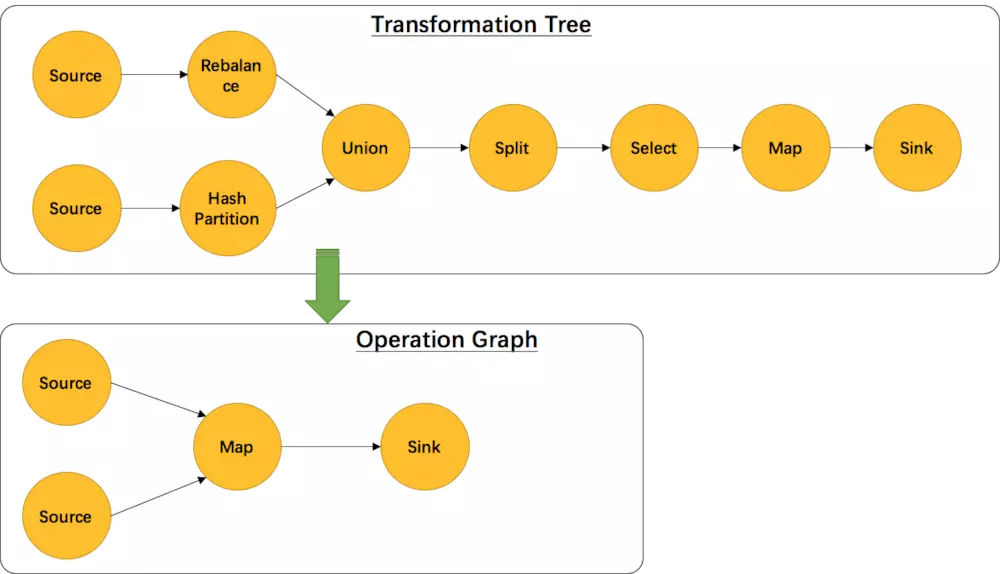
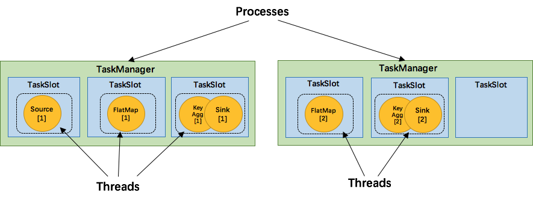
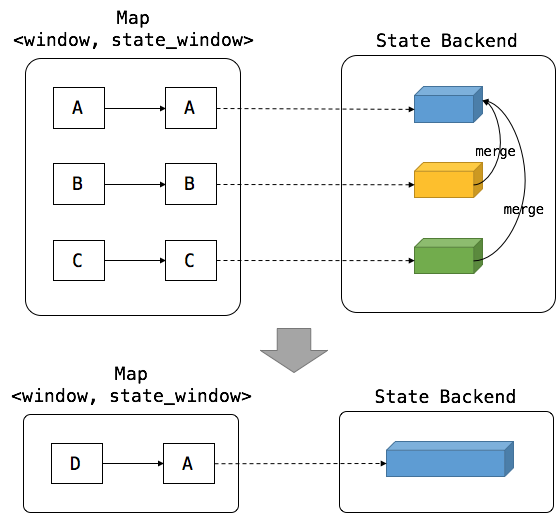

<h1> <center>flink源码剖析</center> </h1>

| 序号 |  作者  | 版本 | 修改时间  | 内容 |
| :--: | :----: | :--: | :-------: |  :-------: |
|  1   | 苗文婷 | 0.1  | 2019-06-10 | |


[TOC]

Jark's Blog: [http://wuchong.me]


### 1. 概述

#### 1.1 功能特性

Flink是一个用于流处理和批处理的开源分布式平台，它的核心是流处理引擎（streaming dataflow engine）。

batch dataset可以视作streaming dataset的一种特例，所以Flink可通过流处理引擎同时处理batch、streaming两种类型的数据。这和spark streaming刚好相反，spark streaming是通过micro batch实现对streaming处理的支持。

-可提供准确的结果产出，即使遇到乱序数据、迟到数据；
-有状态可容错（轻量级），可以无感知地从失败中恢复并保持exactly-once的语义（也可以降级为at-least-once进一步降低消息处理延时）；
-可以大规模地运行在成千上万个节点上并保持高吞吐、低延迟，可以standalone模式运行，也可以在YARN和Mesos等资源管理平台上运行；
-灵活地支持多种基于时间、数量、会话的窗口；
-savepoint提供了状态管理机制；

Flink自上而下的全局组成结构图:


#### 1.2 编程模型

##### 1.2.1 API

Flink提供了不同层次的API用于streaming/batch应用的开发，如下图所示：


最底层的抽象仅提供状态流（stateful streaming），它通过处理函数嵌入到DataStream API中。
实践中用Core API比较多，这些流式的API提供了通用的构建入口用于数据处理，像各种用户自定义的transformation、join、aggregation、window、state等。
Table API是以表为中心的声明式DSL（领域特定语言），当这些Table表示的是stream时，Table是动态变化的。Table API遵循扩展的关系模型，提供了包括select、project、join、group-by、aggregate等操作。
Flink提供的最高层级的API是SQL，它在语义和表达能力上与Table API是类似的。

###### 1.2.1.1 DataStream API

在data stream上实现转换，如filter、update state、define windows、aggregate。DataStream中的transformation可以将一个或多个DataStream转换为一个DataStream。API参考https://ci.apache.org/projects/flink/flink-docs-release-1.4/dev/datastream_api.html。

常用的转换算子包括：

map：输入一个element产生另一个element；
flatMap：输入一个element产生0个或多个element；
filter：对一个element，仅当布尔函数返回true时保留这个element；
keyBy：按照某个指定的key的值，将一个stream划分为多个不相交的partition，一个partition中所有element的这个key的值相同；
reduce：将当前的element与最近一次生成的reduced值进行合并，然后消除这个element（reduce作用在经过keyBy的数据流上）；
fold：类似于reduce，但它是对流中的element进行折叠；
聚合算子，包括min、minBy、max、maxBy；
window：一个流被keyBy划分为若干个partition后，对各partition可以执行window，比如收集最近5分钟的数据；
window apply/reduce/fold/聚合：对一个window中的数据进行某种处理；
union：将多个流合并为一个流，这个流包含这些流的所有element；
对于stream的partition，Flink提供了自定义功能对partition过程进行定制。

我们可以把不同的算子链接到一起，使得它们在一个相同的线程中运行以获得更好的性能表现。默认情况下，Flink会尽可能地将能链接到一起的算子链接到一起。但我们可以使用类似于startNewChain()、disableChaining()进行干预。

data source：数据源可以是基于文件的、基于socket的、基于集合的，对于这些类型的数据源Flink都提供了接口可以直接从指定文件或socket或集合读入数据流。Flink也支持自定义source function，如从kafka中读取数据流。Flink支持为读取的element打上时间戳。

data sink：可以将经过各种算子处理后的数据流写到文件、csv、socket中，也可以写到自定义的sink（如kafka）。


###### 1.2.1.2 DataSet API

DataSet API在data set上实现转换，如filter、map、join、group。

DataSet API和DataStream API类似（大部分算子），少数特有的如下：

groupBy：类似于DataStream API中的keyBy；
dinstinct：返回数据集中的所有不同元素；
其它；
API参考https://ci.apache.org/projects/flink/flink-docs-release-1.4/dev/batch/index.html。


###### 1.2.1.3 Table API & SQL

Table API是一种类SQL表达式语言，可以用于关系流（relational stream）和batch，可以嵌入到DataStream API和DataSet API中。

Flink的SQL支持是基于Apache Calcite实现的，其中Apache Calcite实现了SQL标准。

Flink的Table API和SQL尚未完全实现，并非所有的功能都能支持，还在开发中。

API参考https://ci.apache.org/projects/flink/flink-docs-release-1.4/dev/table/index.html。

###### 1.2.1.4 Flink提供的库

##### 1.2.2 Flink程序与Streaming dataflow

Flink程序的基本元素包括：

stream：由连续不断的data record组成的数据流。
transformation：是一种转换操作，作用在一个或多个stream上，输出一个或多个stream。
每个Flink程序可以映射为一个streaming dataflow，这个dataflow由stream和transformation operator组成。每个dataflow是一个DAG，从一个或多个source开始，结束于一个或多个sink。

Flink程序/Streaming dataflow的结构如下图所示：


一个标准Flink程序的组成：

获取一个执行环境（StreamExecutionEnvironment用于流处理，ExecutionEnvironment用于批处理），执行环境可以决定将下面的计算放在本地jvm运行还是提交到Flink集群中运行；
加载初始数据；
在数据上指定需要执行的transformation；
指定将计算结果写到哪里；
触发程序执行

##### 1.2.3 并行的dataflow

Flink程序在实际运行中是并行的、分布式的：

一个stream会被拆分为一个或多个stream partitions。
一个transformation operator可以拆分为一个或多个operator subtask（subtask的数量称为这个operator的并行度）。每个operator subtask和其它的operator subtask相互独立，并运行在不同的线程中（甚至在不同的机器上）Flink程序中的source、sink也都属于transformation operator。
一个transformation operator中的operator subtask个数就是这个operator的并行度；一个stream的并行度为对应的producing operator（从数据源读数据的operator）的个数。一个程序中的不同operator可能会有不同的并行度。

一个dataflow的运行结构如下图所示：


流中的数据在不同operator之间的传递方式有两种：

one-to-one：像上图的Source[1] -> map[1]。
redistributing：像上图的map[1] -> keyBy()/window()/apply() [1]和[2]。

##### 1.2.4 窗口window

在streams上对event进行聚合（如count、sum）与批处理不同，需要通过window限定聚合的event范围，如统计最近5分钟的event数量。stream上的window可以是时间驱动（如每30秒），也可以是数据驱动（如每100个元素）。

window类型的典型划分：

tumbling windows：不同window之间的元素不重叠。
sliding window：不同window之间的元素可重叠。
session window：即通过会话来区分window。

一个stream上可以同时有多个window:


##### 1.2.5 有状态的Operation

dataflow中很多operator在一个时间点通常只关注一个event，是无状态的；而有些operator会需要记忆跨多个event的信息，这些operator就是有状态的。

有状态的operator的状态以key/value的形式存储（在内存、HDFS或RocksDB中），并与stream一起被分割分布式存储。

##### 1.2.6 Checkpoint与容错

Flink通过流重放（stream replay）、检查点（checkpointing）来实现容错。

checkpoint存储的信息包括某个特定event在stream中的偏移量、dataflow中相关operator处理到这个event时的状态。

一个stream dataflow可以从一个任意指定的checkpoint恢复（加载checkpoint中各operator的状态，然后从stream中指定event位置开始重放），同时保证exactly-once语义。

对flink的checkpoint时间间隔，如果设置的较长，则容错开销小，但是从checkpoint恢复时间长（因为需要重放很多的event）；如果设置的较短，则恢复很快，但是容错开销大（存储了很多checkpoints）。

需要说明的是，Flink将批处理看做流处理的一种特殊情形（即stream是有界的情形）。Flink对批处理并不用checkpoint，因为考虑到batch data是有限的，当处理数据失败了把所有数据重放一遍即可。因而批处理中处理event会更快（因为避免了checkpoint）。

##### 1.2.7 WaterMark

WaterMark（包含一个时间戳）可以像正常的element一样插入到stream中，用于告诉operator不会有比它自己更晚的element到来。WaterMark在source中发射，并通过operator在stream中向下传播。

watermark只是启发式的，如果有比watermark的event time早的element在watermark之后到，operator仍然需要支持处理（抛弃或更新结果）。当source发了一个最终的watermark（时间戳为Long.MAX_VALUE），收到它的operator就知道不会有更多的输入了。


#### 1.3 分布式runtime

##### 1.3.1 任务链与Operator链

为了能够分布式执行，Flink将operator subtask链式拼接为一个task，每个task由一个线程来执行。这是一个很有用的优化，它可以降低线程之间的切换开销，增加Flink的吞吐量，并降低处理延时。

下图展示的是一个dataflow，其中涉及到source、map()、keyBy()/window()/apply()、sink等operator。

source和map分别都被拆分为两个operator subtask并各分配一个线程，其中考虑到event在source、map中的传输方式是one-to-one所以将source和map链接在同一个线程里；
keyBy()/window()/apply()也被拆分为两个operator subtask并各占一个线程；


##### 1.3.2 JobManager/TaskManager/Client

要了解一个系统，一般是从架构开始。我们关心的问题是：系统部署成功后各个节点都启动了哪些服务，各个服务之间又是怎么交互和协调的。

JobManager、TaskManager和Client之间的交互如下图所示:


当Flink集群启动后，首先会启动一个JobManager和一个或多个TaskManager。由Client提交任务给JobManager，JobManager再调度任务到各个TaskManager去执行，

然后TaskManager将心跳和统计信息汇报给JobManager。TaskManager之间以流的形式进行数据的传输。上述三者均为独立的JVM进程。

Flink运行时包含两种类型的进程：

（1）JobManager（master）：协调job的分布式执行，具体包括调度task、协调checkpoint、协调从失败中恢复等，职责上很像 Storm 的 Nimbus。从 Client 处接收到 Job 和 JAR 包等资源后，会生成优化后的执行计划，并以 Task 的单元调度到各个 TaskManager 去执行。

在实际部署中，至少有一个JobManager，高可用模式下会有多个JobManager（一个作为leader其它作为standby）。

（2）TaskManager（worker）：在启动的时候就设置好了槽位数（Slot），每个 slot 能启动一个 Task，Task 为线程。从 JobManager 处接收需要部署的 Task，部署启动后，与自己的上游建立 Netty 连接，接收数据并处理。

负责dataflow中task的具体执行（更具体地说是subtask）。TaskManager需要连接到JobManager，告诉它自己是可用的，并等待被分配任务。在实际部署中，也至少有一个TaskManager。

在单机伪分布模式下，只有JobManager进程，而TaskManager会作为JobManager进程中的一个线程。JobManager和TaskManager可以直接在机器上启动，也可以通过资源管理框架（如YARN、Mesos）来管理启动。

（3）Client为提交Job的客户端，可以是运行在任何机器上（与JobManager环境连通即可）。提交Job后，Client可以结束进程（Streaming任务），也可以不结束并等待结果返回。Client不是Flink

运行时的组成部分，被用于向JobManager发送Job，此后可以断开连接或者等待JobManager的任务执行进度报告）。


##### 1.3.3 Task槽(Slot)与资源

每个TaskManager是一个JVM进程，会在不同的线程中执行一个或多个operator subtask。为了控制单个TaskManager所能接收的任务数量，每个TaskManager会包含一组Task槽（至少会有一个）。

一个Task槽表示TaskManager JVM进程中一组固定的资源，可以被一个或多个线程（或operator subtask）共享。

例如，对一个包含3个Task槽的TaskManager，它会把进程中1/3的资源（如内存）分配给各个槽。不同Task槽中的subtask互相独立不会互相争夺资源，但是会共享JVM中的TCP连接、心跳消息。Task槽目前只是用于隔离Task使用的内存。

TaskManager JVM中operator subtask、thread、task slot之间的关系：

一个TaskManager JVM进程会有一个或多个Task Slot（个数一般与cpu core的个数相等），每个Task Slot能分配到这个JVM中的一部分资源（内存）；
一个Task Slot（中的资源）可以被一个或多个线程共享。一个线程中运行一个operator subtask或链接起来的多个operator subtask。


##### 1.3.4 状态存储

streaming dataflow中的一些operator（如windows）是有状态的。这些状态（被索引的键值对）作为checkpoint的一部分，可以存储在内存/HDFS/RocksDB中（通过配置控制）。


##### 1.3.5 保存点(savepoint)

使用DataStream API编写的Flink程序可以从任意指定的savepoint开始执行。Savepoint允许你“冻结”stream的处理、更新你的flink程序甚至你的flink集群（如升级版本），然后可以从savepoints恢复执行。

savepoint是手工触发的checkpoints，也依赖checkpointing机制，可以对当前的状态生成快照并保存。


### 2. 配置

#### 2.1 配置文件

flink-conf.yaml:

|        属性       |    描述  | 默认值或示例值 |
| ---------------- | -------- | ------ |
| akka.ask.timeout |          | 10s    |
| akka.framesize |          | 10485760b    |
| akka.log.lifecycle.events |          | false   |
| akka.lookup.timeout |          | 10s    |
| akka.ssl.enabled |          | false    |
| akka.startup-timeout |          | 10s    |
| akka.tcp.timeout |          | 20s    |
| akka.throughput |          | 15   |
| akka.watch.heartbeat.interval |          | 10s    |
| akka.watch.heartbeat.pause |          | 60s    |
| akka.watch.threshold |          | 12    |
| blob.fetch.backlog |          | 1000    |
| blob.fetch.num-concurrent |          | 50    |
| blob.fetch.retries |          | 50    |
| blob.server.port |          | 32456-32520    |
| blob.service.ssl.enabled |          | false    |
| client.rpc.port |          | client.rpc.port    |
| compiler.delimited-informat.max-line-samples |          | 10    |
| compiler.delimited-informat.max-sample-len |          | 2097152    |
| compiler.delimited-informat.min-line-samples |          | 2    |
| env.java.opts.jobmanager |          | -Djava.security.krb5.conf=/opt/huawei/Bigdata/FusionInsight_BASE_V100R002C80SPC200/2_15_KerberosClient/etc/kdc.conf    |
| env.java.opts.taskmanager |          | -Djava.security.krb5.conf=/opt/huawei/Bigdata/FusionInsight_BASE_V100R002C80SPC200/2_15_KerberosClient/etc/kdc.conf    |
| env.java.opts |          | -Xloggc:<LOG_DIR>/gc.log -XX:+PrintGCDetails -XX:-OmitStackTraceInFastThrow -XX:+PrintGCTimeStamps -XX:+PrintGCDateStamps -XX:+UseGCLogFileRotation -XX:NumberOfGCLogFiles=20 -XX:GCLogFileSize=20M -Djdk.tls.ephemeralDHKeySize=2048    |
| flink.security.enable |          | true    |
| fs.output.always-create-directory |          | false    |
| fs.overwrite-files |          | false    |
| high-availability.job.delay |          | 10s    |
| high-availability.storageDir |          | hdfs://hacluster/flink/recovery    |
| high-availability.zookeeper.client.acl |          | creator    |
| high-availability.zookeeper.client.connection-timeout |          | 15000    |
| high-availability.zookeeper.client.max-retry-attempts |          | 3    |
| high-availability.zookeeper.client.retry-wait |          | 5000    |
| high-availability.zookeeper.client.session-timeout |          | 60000   |
| high-availability.zookeeper.path.root |          | /flink    |
| high-availability.zookeeper.quorum |          | 192.168.90.60:24002,192.168.90.70:24002,192.168.90.51:24002    |
| high-availability |          | zookeeper    |
| jobmanager.heap.mb |          | 512    |
| jobmanager.web.403-redirect-url |          | https://192.168.90.51:28443/web/pages/error/403.html    |
| jobmanager.web.404-redirect-url |          | https://192.168.90.51:28443/web/pages/error/404.html    |
| jobmanager.web.415-redirect-url |          | https://192.168.90.51:28443/web/pages/error/415.html    |
| jobmanager.web.500-redirect-url |          | https://192.168.90.51:28443/web/pages/error/500.html    |
| jobmanager.web.access-control-allow-origin |          | 192.168.90.60,192.168.90.51   |
| jobmanager.web.accesslog.enable |          | true    |
| jobmanager.web.allow-access-address |          | 192.168.90.60,192.168.90.51    |
| jobmanager.web.backpressure.cleanup-interval |          | 600000    |
| jobmanager.web.backpressure.delay-between-samples |          | 50    |
| jobmanager.web.backpressure.num-samples |          | 100   |
| jobmanager.web.backpressure.refresh-interval |          | 60000    |
| jobmanager.web.cache-directive |          | no-store    |
| jobmanager.web.checkpoints.disable |          | false    |
| jobmanager.web.checkpoints.history |          | 10    |
| jobmanager.web.expires-time |          | 0    |
| jobmanager.web.history |          | 5    |
| jobmanager.web.logout-timer |          | 600000    |
| jobmanager.web.port |          | 32261-32325    |
| jobmanager.web.pragma-value |          | no-cache    |
| jobmanager.web.refresh-interval |          | 3000    |
| jobmanager.web.ssl.enabled |          | false    |
| jobmanager.web.x-frame-options |          | DENY    |
| library-cache-manager.cleanup.interval |          | 3600    |
| nettyconnector.message.delimiter |          | $_    |
| nettyconnector.registerserver.topic.storage |          | /flink/nettyconnector    |
| nettyconnector.sinkserver.port.range |          | 28444-28943    |
| nettyconnector.sinkserver.subnet |          | 0.0.0.0/32    |
| nettyconnector.ssl.enabled |          | false    |
| parallelism.default |          | 1    |
| query.client.network-threads |          |  0   |
| query.proxy.network-threads |          |  0   |
| query.proxy.ports |          | 32541-32560    |
| query.proxy.query-threads |          | 0    |
| query.server.network-threads |          | 0    |
| query.server.ports |          | 32521-32540    |
| query.server.query-threads |          | 0    |
| restart-strategy.failure-rate.delay |          | 10s    |
| restart-strategy.failure-rate.failure-rate-interval |          | 60s    |
| restart-strategy.failure-rate.max-failures-per-interval |          | 1    |
| restart-strategy.fixed-delay.attempts |          | 3    |
| restart-strategy.fixed-delay.delay |          | 10s    |
| restart-strategy |          | none    |
| security.cookie |          | e68bb8d0-1d0e-4852-9835-7406a04c729051261cfb-67cc-4843-803d-972f58a71e75    |
| security.enable |          | true    |
| security.kerberos.login.contexts |          | Client,KafkaClient    |
| security.kerberos.login.keytab |          | /etc/security/keytabs/user.keytab    |
| security.kerberos.login.principal |          | test1@HADOOP.COM    |
| security.kerberos.login.use-ticket-cache |          | true    |
| security.ssl.algorithms |          | TLS_RSA_WITH_AES_128_CBC_SHA256,TLS_DHE_RSA_WITH_AES_128_CBC_SHA256,TLS_DHE_DSS_WITH_AES_128_CBC_SHA256   |
| security.ssl.enabled |          | false    |
| security.ssl.key-password |          | 123456    |
| security.ssl.keystore-password |          | 123456     |
| security.ssl.keystore |          | /Users/miaowenting/Work/env/fi_flink_client/conf/flink.keystore    |
| security.ssl.protocol |          | TLSv1.2    |
| security.ssl.truststore-password |          | 123456    |
| security.ssl.truststore |          | /Users/miaowenting/Work/env/fi_flink_client/conf/flink.truststore    |
| security.ssl.verify-hostname |          | false    |
| state.backend.fs.checkpointdir |          | hdfs:///flink/checkpoints    |
| state.savepoints.dir |          | hdfs:///flink/savepoint    |
| task.cancellation.interval |          | 30000   |
| taskmanager.data.port |          | 32391-32455    |
| taskmanager.data.ssl.enabled |          | false    |
| taskmanager.debug.memory.logIntervalMs |          | 0     |
| taskmanager.debug.memory.startLogThread |          | false   |
| taskmanager.heap.mb |          | 512    |
| taskmanager.initial-registration-pause |          | 500ms    |
| taskmanager.max-registration-pause |          | 30s    |
| taskmanager.maxRegistrationDuration |          | Inf    |
| taskmanager.memory.fraction |          | 0.7    |
| taskmanager.memory.off-heap |          | false    |
| taskmanager.memory.preallocate |          | false    |
| taskmanager.memory.segment-size |          | 32768    |
| taskmanager.memory.size |          | -1    |
| taskmanager.network.netty.client.connectTimeoutSec |          | 120    |
| taskmanager.network.netty.client.numThreads |          | 1    |
| taskmanager.network.netty.num-arenas |          | 1    |
| taskmanager.network.netty.sendReceiveBufferSize |          | 4096    |
| taskmanager.network.netty.server.numThreads |          | 1    |
| taskmanager.network.netty.transport |          | nio    |
| taskmanager.network.numberOfBuffers |          | 2048    |
| taskmanager.numberOfTaskSlots |          | 1     |
| taskmanager.refused-registration-pause |          | 10s    |
| taskmanager.rpc.port |          | 32326-32390    |
| taskmanager.runtime.hashjoin-bloom-filters |          | false    |
| taskmanager.runtime.max-fan |          | 128    |
| taskmanager.runtime.sort-spilling-threshold |          | 0.8    |
| yarn.application-attempts |          | 2    |
| yarn.application-master.port |          | 32586-32650   |
| yarn.containers.vcores |          | 1    |
| yarn.heap-cutoff-min |          | 384    |
| yarn.heap-cutoff-ratio |          | 0.25    |
| yarn.heartbeat-delay |          | 5    |
| yarn.maximum-failed-containers |          | 5    |
| zookeeper.sasl.disable |          | false    |
| zookeeper.sasl.service-name |          | zookeeper    |
| zookeeper.sasl.login-context-name |          | Client    |
| classloader.resolve-order |          | parent-first   |


#### 2.2 任务运行参数

```
 yarncontainer： 1
 yarntaskManagerMemory： 1024M
 yarnjobManagerMemory: 1024M
 yarnslots: 1
```

### 3. 安装部署

#### 3.1 安装步骤

#### 3.2 启动脚本

Flink提供了两个启动脚本：bin/start-local.sh用于启动单机模式的Flink；bin/start-cluster.sh用于启动集群模式的Flink。

（1）start-local.sh

解析提取flink-yaml.xml中的配置项，各配置项的含义可参考https://ci.apache.org/projects/flink/flink-docs-master/ops/config.html。
以daemon模式启动jobmanager进程（并分出一个线程启动taskmanager）。
（2）start-cluster.sh

解析提取flink-yaml.xml中的配置项。
通过ssh远程启动各master机器上的jobmaster进程（需要在conf/masters中配置master机器的ip地址，默认是localhost:8081）。
启动taskmanager进程（需要在conf/slaves配置slave机器的ip地址，通常是localhost）。
由flink-daemon.sh可知，Flink中各主要进程的入口对应关系如下：

jobmanager	org.apache.flink.runtime.jobmanager.JobManager
taskmanager	org.apache.flink.runtime.taskmanager.TaskManager
内置zookeeper	org.apache.flink.runtime.zookeeper.FlinkZooKeeperQuorumPeer
historyserver	org.apache.flink.runtime.webmonitor.history.HistoryServer


#### 3.3 CLI脚本

Flink提供的CLI脚本是bin/flink，可以通过该脚本提交Job、创建Savepoint等。

脚本的主要流程：

解析提取flink-yaml.xml中的配置项。
通过Client入口org.apache.flink.client.CliFrontend连接到JobManager并发送消息。

### 4. 监控

#### 4.1 Metric监控

Flink包含了一个metric系统，可采集用户范围/系统范围的监控指标并输出给外部监控系统，如Ganglia/Graphite/StatsD等。采集的监控指标包括CPU、内存、线程、垃圾收集、类加载器、网络、集群、高可用、checkpointing、IO、source连接器等。

开发者可以在用户函数中访问metric系统，自定义并统计metric。

详情可参考https://ci.apache.org/projects/flink/flink-docs-release-1.4/monitoring/metrics.html。

#### 4.2 Checkpoint监控

Flink提供了dashboard用于监控Job的checkpoint。即使Job完成运行，对应的checkpoint统计数据仍然是可以查询的。

详情可以参考https://ci.apache.org/projects/flink/flink-docs-release-1.4/monitoring/checkpoint_monitoring.html。

#### 4.3 Back Pressure监控

如果你看到一个task的背压（back pressure）告警，这表示这个task产生数据的速度超过了下游operator的消费速度。数据在job flow中是按照从source到sink的方向流动的，而背压是沿着相反的方向传播。

详情可以参考https://ci.apache.org/projects/flink/flink-docs-release-1.4/monitoring/back_pressure.html。

#### 4.4 监控REST API

Flink基于Netty提供了一组监控API用于查询正在运行/最近完成的Job的状态和统计数据，这些API用于输出监控数据给Flink自身的Dashboard，但是也可以用于开发定制化的监控工具。

详情可以参考https://ci.apache.org/projects/flink/flink-docs-release-1.4/monitoring/rest_api.html。

### 5. 源码剖析

#### 5.1 准备工作

编译源码：
```
mvn clean -Drat.ignoreErrors=true install -DskipTests -Dmaven.javadoc.skip=true -Dcheckstyle.skip=true
```

-Drat.skip=true

本地debug基本方法如下：

```
1、在jvm启动参数中添加远程调试参数

（1）如果是调试Client，可以将上述参数加到bin/flink脚本的最后一行中，形如：
JVM_REMOTE_DEBUG_ARGS='-agentlib:jdwp=transport=dt_socket,server=y,suspend=y,address=5005'
exec $JAVA_RUN $JVM_ARGS $JVM_REMOTE_DEBUG_ARGS "${log_setting[@]}" -classpath "`manglePathList "$CC_CLASSPATH:$INTERNAL_HADOOP_CLASSPATHS"`" org.apache.flink.client.CliFrontend "$@"

（2）如果是调试JobManager或TaskManager，可以在conf/flink-conf.yaml中添加：
env.java.opts: -agentlib:jdwp=transport=dt_socket,server=y,suspend=y,address=5006

2、启动flink client或jobmanager或taskmanager，此时程序会suspend等待debuger连接（通过suspend=y来配置）。

3、配置IDEA中的remote：host配置为localhost，配置port（参考1中的配置的address端口）。

4、在Flink源码中设置断点，连接远程host，然后就可以开始debug跟踪了。

```

#### 5.2 SocketWindowWordCount


#### 5.3 StreamTransformation

StreamTransformation的10个子类实现:


这些transformation会构造出一颗StreamTransformation树，通过这棵树转成StreamGraph
跟踪SingleOutputStreamOperator的map源码:

```
public <R> SingleOutputStreamOperator<R> map(MapFunction<T, R> mapper) {
  // 通过java reflection抽出mapper的返回值类型
  TypeInformation<R> outType = TypeExtractor.getMapReturnTypes(clean(mapper), getType(),
      Utils.getCallLocationName(), true);

  // 返回一个新的DataStream，SteramMap 为 StreamOperator 的实现类
  return transform("Map", outType, new StreamMap<>(clean(mapper)));
}

public <R> SingleOutputStreamOperator<R> transform(String operatorName, TypeInformation<R> outTypeInfo, OneInputStreamOperator<T, R> operator) {
  // read the output type of the input Transform to coax out errors about MissingTypeInfo
  transformation.getOutputType();

  // 新的transformation会连接上当前DataStream中的transformation，从而构建成一棵树
  OneInputTransformation<T, R> resultTransform = new OneInputTransformation<>(
      this.transformation,
      operatorName,
      operator,
      outTypeInfo,
      environment.getParallelism());

  @SuppressWarnings({ "unchecked", "rawtypes" })
  SingleOutputStreamOperator<R> returnStream = new SingleOutputStreamOperator(environment, resultTransform);

  // 所有的transformation都会存到 env 中，调用execute时遍历该list生成StreamGraph
  getExecutionEnvironment().addOperator(resultTransform);

  return returnStream;
}

```

从上方代码可以了解到，map转换将用户自定义的函数MapFunction包装到StreamMap这个Operator中，再将StreamMap包装到OneInputTransformation，最后该transformation
存到env中，当调用env.execute时，遍历其中的transformation集合构造出StreamGraph。其分层实现如下图所示:


并不是每一个 StreamTransformation 都会转换成 runtime 层中物理操作。有一些只是逻辑概念，比如 union、split/select、partition等。
如下图所示的转换树，在运行时会优化成下方的操作图:



通过源码也可以发现，UnionTransformation,SplitTransformation,SelectTransformation,
PartitionTransformation由于不包含具体的操作所以都没有StreamOperator成员变量，而其他StreamTransformation的子类基本上都有。


如下程序，是一个从 Source 中按行切分成单词并过滤输出的简单流程序，其中包含了逻辑转换：随机分区shuffle。我们会分析该程序是如何生成StreamGraph的。

```
DataStream<String> text = env.socketTextStream(hostName, port);
text.flatMap(new LineSplitter()).shuffle().filter(new HelloFilter()).print();

```

首先会在env中生成一棵transformation树，用List<StreamTransformation<?>> 保存。其结构图如下:


其中，符号*为input指针，指向上游的transformation，从而形成一棵transformation树。
然后，通过调用StreamGraphGenerator.generate(env,transformation)来生成StreamGraph。
自底向上递归调用每一个transformation,也就是说处理顺序是Source -> FlatMap -> Shuffle -> Filter -> Sink:


如上图所示:

1.
2.
3.
4.
5.


#### 5.4 StreamOperator

DataStream 上的每一个 Transformation 都对应了一个 StreamOperator，StreamOperator是运行时的具体实现，会决定UDF(User-Defined Funtion)的调用方式。
下图所示为 StreamOperator 的类图:


可以发现，所有实现类都继承了AbstractStreamOperator。另外除了 project 操作，其他所有可以执行UDF代码的实现类都继承自AbstractUdfStreamOperator，
该类是封装了UDF的StreamOperator。UDF就是实现了Function接口的类，如MapFunction,FilterFunction


#### 5.5 Graph

Flink中的执行图可以分为4层:

StreamGraph -> JobGraph -> ExecutionGraph -> 物理执行图


- StreamGraph

根据用户通过Stream API编写的代码生成的最初的图

StreamNode: 用来代表operator的类，并具有所有相关的属性，如并发度、入边和出边等

StreamEdge: 表示连接两个StreamNode的边

- JobGraph

StreamGraph经过优化后生成了JobGraph，提交给JobManager的数据结构

JobVertex: 经过优化后的符合条件的多个StreamNode可能会chain在一起生成一个JobVertex，即一个JobVertex包含一个或多个operator，

JobVertex的输入是JobEdge，输出是IntermediateDataSet

IntermediateDataSet: 表示JobVertex的输出，即经过operator处理产生的数据集。producer是JobVertex，consumer是JobEdge。

JobEdge: 代表了JobGraph中一条数据传输通道。source是IntermediateDataSet，target是JobVertex。即数据通过JobEdge由IntermediateDataSet

传递给目标JobVertex。


- ExecutionGraph

JobManager根据JobGraph生成ExecutionGraph，ExecutionGraph是JobGraph的并行化版本，是调度层最核心的数据结构。

ExecutionJobVertex: 和JobGraph中的JobVertex一一对应，每个ExecutionJobVertex都有和并发度一样多的ExecutionVertex。

ExecutionVertex: 表示ExecutionJobVertex的其中一个并发子任务，输入是ExecutionEdge，输出是IntermediateResultPartition。

IntermediateResult: 和JobGraph中的IntermediateDataSet一一对应。一个IntermediateResult包含多个IntermediateResultPartition，其个数等于该operator的并发度。

IntermediateResultPartition: 表示ExecutionVertex的一个输出分区，producer是ExecutionVertex，consumer是若干个ExecutionEdge。

ExecutionEdge: 表示ExecutionVertex的输入，source是IntermediateResultPartition，target是ExecutionVertex。source和target都只能是一个。

Execution: 是执行一个 ExecutionVertex 的一次尝试。当发生故障或者数据需要重算的情况下 ExecutionVertex 可能会有多个 ExecutionAttemptID。一个 Execution 通过 ExecutionAttemptID 来唯一标识。

JM和TM之间关于 task 的部署和 task status 的更新都是通过 ExecutionAttemptID 来确定消息接受者。


- 物理执行图

JobManager根据ExecutionGraph对Job进行调度后，在各个TaskManager上部署Task后形成的"图"，并不是一个具体的数据结构。

Task: Execution被调度后在分配的TaskManager中启动对应的Task。Task包裹了具有用户执行逻辑的operator。

ResultPartition: 代表由一个Task生成的数据，和ExecutionGraph中的IntermediateResultPartition一一对应。

ResultSubpartition: 是ResultPartition的一个子分区，每个ResultPartition包含多个ResultSubpartition，其数目要由下游消费Task数和DistributionPattern

来决定。

InputGate: 代表Task的输入封装，和JobGraph的JobEdge一一对应。每个InputGate消费了一个或多个ResultPartition。

InputChannel: 每个InputGate包含一个以上的InputChannel，和ExecutionGraph中的ExecutionEdge一一对应，也和ResultSubpartition一对一地相连，

即一个InputChannel接收一个ResultSubpartition的输出。


Flink中为什么要有这4张图呢？目的是解耦，每张图各司其职，每张图对应了Job的不同阶段，更方便做该阶段的事情。以下给出更完整的Flink Graph的层次图:


首先我们看到，JobGraph 之上除了 StreamGraph 还有 OptimizedPlan。OptimizedPlan 是由 Batch API 转换而来的。StreamGraph 是由 Stream API 转换而来的。为什么 API 不直接转换成 JobGraph？因为，Batch 和 Stream 的图结构和优化方法有很大的区别，比如 Batch 有很多执行前的预分析用来优化图的执行，而这种优化并不普适于 Stream，所以通过 OptimizedPlan 来做 Batch 的优化会更方便和清晰，也不会影响 Stream。JobGraph 的责任就是统一 Batch 和 Stream 的图，用来描述清楚一个拓扑图的结构，并且做了 chaining 的优化，chaining 是普适于 Batch 和 Stream 的，所以在这一层做掉。ExecutionGraph 的责任是方便调度和各个 tasks 状态的监控和跟踪，所以 ExecutionGraph 是并行化的 JobGraph。而“物理执行图”就是最终分布式在各个机器上运行着的tasks了。所以可以看到，这种解耦方式极大地方便了我们在各个层所做的工作，各个层之间是相互隔离的。


##### 5.5.1 如何生成StreamGraph

SocketWindowWordCount生成StreamGraph的代码流程图:


将最后一行代码env.execute 替换成 System.out.println(env.getExecutionPlan()) , 并在本地运行该代码，可以得到该拓扑的逻辑执行计划图的JSON串:

```
{
    "nodes":[
        {
            "id":1,
            "type":"Source: Socket Stream",
            "pact":"Data Source",
            "contents":"Source: Socket Stream",
            "parallelism":1
        },
        {
            "id":2,
            "type":"Flat Map",
            "pact":"Operator",
            "contents":"Flat Map",
            "parallelism":8,
            "predecessors":[
                {
                    "id":1,
                    "ship_strategy":"REBALANCE",
                    "side":"second"
                }
            ]
        },
        {
            "id":4,
            "type":"Window(TumblingProcessingTimeWindows(5000), ProcessingTimeTrigger, ReduceFunction$1, PassThroughWindowFunction)",
            "pact":"Operator",
            "contents":"Window(TumblingProcessingTimeWindows(5000), ProcessingTimeTrigger, ReduceFunction$1, PassThroughWindowFunction)",
            "parallelism":8,
            "predecessors":[
                {
                    "id":2,
                    "ship_strategy":"HASH",
                    "side":"second"
                }
            ]
        },
        {
            "id":5,
            "type":"Sink: Print to Std. Out",
            "pact":"Data Sink",
            "contents":"Sink: Print to Std. Out",
            "parallelism":1,
            "predecessors":[
                {
                    "id":4,
                    "ship_strategy":"REBALANCE",
                    "side":"second"
                }
            ]
        }
    ]
}


```

将该JSON串粘贴到http://flink.apache.org/visualizer/ 中，能可视化该执行图:


但这并不是最终在Flink中运行的执行图，只是一个表示拓扑节点关系的计划图，在Flink中对应了StreamGraph。提交拓扑后还能在UI中看到另一张执行计划图，该图对应了

Flink中的JobGraph:

```
./start-cluster.sh

http://localhost:8081

nc -l 9999

bin/flink run examples/streaming/SocketWindowWordCount.jar --hostname localhost  --port 9999 

```


任务输出的统计结果:


##### 5.5.2 如何生成JobGraph

根据用户用 Stream API 编写的程序，构造出一个代表拓扑结构的StreamGraph，以WordCount为例，转换图如下图所示：


StreamGraph和JobGraph都是在Client端生成的，也就是我们可以在idea中通过断点调试观察StreamGraph和JobGraph的生成过程。

JobGraph 的相关数据结构主要在 jobgraph包中。构造 JobGraph 的代码主要集中在 StreamingJobGraphGenerator 类中，入口函数是

StreamingJobGraphGenerator.createJobGraph()


##### 5.5.3 如何生成ExecutionGraph


##### 5.5.4 如何进行调度(如何生成物理执行图)


#### 5.6 理解Flink中的计算资源

计算资源是指用来执行 Task 的资源，是一个逻辑概念。本文会介绍 Flink 计算资源相关的一些核心概念，如：Slot、SlotSharingGroup、CoLocationGroup、Chain等。并会着重讨论 Flink 如何对计算资源进行管理和隔离，如何将计算资源利用率最大化等等。理解 Flink 中的计算资源对于理解 Job 如何在集群中运行的有很大的帮助，也有利于我们更透彻地理解 Flink 原理，更快速地定位问题。

##### 5.6.1 Operator Chains

为了更高效地分布式执行，Flink会尽可能地将operator的subtask链接（chain）在一起形成task。每个task在一个线程中执行。将operators链接成task是非常有效的优化：它能减少线程之间的切换，减少消息的序列化/反序列化，减少数据在缓冲区的交换，减少了延迟的同时提高整体的吞吐量。

我们仍以经典的 WordCount 为例（参考前文Job例子），下面这幅图，展示了Source并行度为1，FlatMap、KeyAggregation、Sink并行度均为2，最终以5个并行的线程来执行的优化过程。


上图中将KeyAggregation和Sink两个operator进行了合并，因为这两个合并后并不会改变整体的拓扑结构。但是，并不是任意两个 operator 就能 chain 一起的。其条件还是很苛刻的：
                                       
  - 上下游的并行度一致
  - 下游节点的入度为1 （也就是说下游节点没有来自其他节点的输入）
  - 上下游节点都在同一个 slot group 中（下面会解释 slot group）
  - 下游节点的 chain 策略为 ALWAYS（可以与上下游链接，map、flatmap、filter等默认是ALWAYS）
  - 上游节点的 chain 策略为 ALWAYS 或 HEAD（只能与下游链接，不能与上游链接，Source默认是HEAD）
  - 两个节点间数据分区方式是 forward（参考理解数据流的分区）
  - 用户没有禁用 chain

Operator chain的行为可以通过编程API中进行指定。可以通过在DataStream的operator后面（如someStream.map(..))调用startNewChain()来指示从该operator开始一个新的chain（与前面截断，不会被chain到前面）。

或者调用disableChaining()来指示该operator不参与chaining（不会与前后的operator chain一起）。在底层，这两个方法都是通过调整operator的 chain 策略（HEAD、NEVER）来实现的。另外，也可以通过调用StreamExecutionEnvironment.disableOperatorChaining()来全局禁用chaining。


###### 5.6.1.1 原理与实现

那么 Flink 是如何将多个 operators chain在一起的呢？chain在一起的operators是如何作为一个整体被执行的呢？它们之间的数据流又是如何避免了序列化/反序列化以及网络传输的呢？下图展示了operators chain的内部实现：


如上图所示，Flink内部是通过OperatorChain这个类来将多个operator链在一起形成一个新的operator。OperatorChain形成的框框就像一个黑盒，

Flink 无需知道黑盒中有多少个ChainOperator、数据在chain内部是怎么流动的，只需要将input数据交给 HeadOperator 就可以了，这就使得OperatorChain在行为上与普通的operator无差别，

上面的OperaotrChain就可以看做是一个入度为1，出度为2的operator。所以在实现中，对外可见的只有HeadOperator，以及与外部连通的实线输出，这些输出对应了JobGraph中的JobEdge，在底层通过RecordWriterOutput来实现。

另外，框中的虚线是operator chain内部的数据流，这个流内的数据不会经过序列化/反序列化、网络传输，而是直接将消息对象传递给下游的 ChainOperator 处理，这是性能提升的关键点，在底层是通过 

ChainingOutput 实现的。

注：HeadOperator和ChainOperator并不是具体的数据结构，前者指代chain中的第一个operator，后者指代chain中其余的operator，它们实际上都是StreamOperator。


##### 5.6.2 Task Slot

TaskManager 是一个 JVM 进程，并会以独立的线程来执行一个task或多个subtask。为了控制一个 TaskManager 能接受多少个 task，Flink 提出了 Task Slot 的概念。

Flink 中的计算资源通过 Task Slot 来定义。每个 task slot 代表了 TaskManager 的一个固定大小的资源子集。

例如，一个拥有3个slot的 TaskManager，会将其管理的内存平均分成三分分给各个 slot。将资源 slot 化意味着来自不同job的task不会为了内存而竞争，而是每个task都拥有一定数量的内存储备。需要注意的是，这里不会涉及到CPU的隔离，slot目前仅仅用来隔离task的内存。

通过调整 task slot 的数量，用户可以定义task之间是如何相互隔离的。每个 TaskManager 有一个slot，也就意味着每个task运行在独立的 JVM 中。每个 TaskManager 有多个slot的话，也就是说多个task运行在同一个JVM中。而在同一个JVM进程中的task，可以共享TCP连接（基于多路复用）和心跳消息，可以减少数据的网络传输。也能共享一些数据结构，一定程度上减少了每个task的消耗。

每一个 TaskManager 会拥有一个或多个的 task slot，每个 slot 都能跑由多个连续 task 组成的一个 pipeline，比如 MapFunction 的第n个并行实例和 ReduceFunction 的第n个并行实例可以组成一个 pipeline。

如上文所述的 WordCount 例子，5个Task可能会在TaskManager的slots中如下图分布，2个TaskManager，每个有3个slot：




##### 5.6.3 SlotSharingGroup与CoLocationGroup

默认情况下，Flink允许subtasks共享slots，条件是它们都来自同一个Job的不同task的subtask。结果可能一个slot持有该job的整个pipeline。

允许slot共享有以下两点好处:

1. Flink 集群所需的task slots数与job中最高的并行度一致。也就是说我们不需要再去计算一个程序总共会起多少个task了。

2. 更容易获得更充分的资源利用。如果没有slot共享，那么非密集型操作source/flatmap就会占用同密集型操作 keyAggregation/sink 
一样多的资源。如果有slot共享，将基线的2个并行度增加到6个，能充分利用slot资源，同时保证每个TaskManager能平均分配到重的subtasks。


我们将 WordCount 的并行度从之前的2个增加到6个（Source并行度仍为1），并开启slot共享（所有operator都在default共享组），将得到如上图所示的slot分布图。

首先，我们不用去计算这个job会其多少个task，总之该任务最终会占用6个slots（最高并行度为6）。其次，我们可以看到密集型操作 keyAggregation/sink 被平均地分配到各个 TaskManager。

SlotSharingGroup是Flink中用来实现slot共享的类，它尽可能地让subtasks共享一个slot。相应的，还有一个 CoLocationGroup 类用来强制将 subtasks 放到同一个 slot 中。CoLocationGroup主要用于迭代流中，用来保证迭代头与迭代尾的第i个subtask能被调度到同一个TaskManager上。这里我们不会详细讨论CoLocationGroup的实现细节。

怎么判断operator属于哪个 slot 共享组呢？默认情况下，所有的operator都属于默认的共享组default，也就是说默认情况下所有的operator都是可以共享一个slot的。而当所有input operators具有相同的slot共享组时，该operator会继承这个共享组。

最后，为了防止不合理的共享，用户也能通过API来强制指定operator的共享组，比如：someStream.filter(...).slotSharingGroup("group1");就强制指定了filter的slot共享组为group1。

###### 5.6.3.1 原理与实现

那么多个tasks（operators）是如何共享slot的呢？

看一下用来定义计算资源的slot类图：


抽象类Slot定义了该槽位属于哪个TaskManager（instance）的第几个槽位（slotNumber），属于哪个Job（jobID）等信息。最简单的情况下，一个slot只持有一个task，也就是SimpleSlot的实现。

复杂点的情况，一个slot能共享给多个task使用，也就是SharedSlot的实现。SharedSlot能包含其他的SharedSlot，也能包含SimpleSlot。所以一个SharedSlot能定义出一棵slots树。


接下来我们来看看 Flink 为subtask分配slot的过程。关于Flink调度，有两个非常重要的原则我们必须知道：（1）同一个operator的各个subtask是不能呆在同一个SharedSlot中的，例如FlatMap[1]和FlatMap[2]是不能在同一个SharedSlot中的。（2）Flink是按照拓扑顺序从Source一个个调度到Sink的。

例如WordCount（Source并行度为1，其他并行度为2），那么调度的顺序依次是：Source -> FlatMap[1] -> FlatMap[2] -> KeyAgg->Sink[1] -> KeyAgg->Sink[2]。

假设现在有2个TaskManager，每个只有1个slot（为简化问题），那么分配slot的过程如图所示：


注：图中 SharedSlot 与 SimpleSlot 后带的括号中的数字代表槽位号（slotNumber）

注：图中 SharedSlot 与 SimpleSlot 后带的括号中的数字代表槽位号（slotNumber）

为Source分配slot。首先，我们从TaskManager1中分配出一个SharedSlot。并从SharedSlot中为Source分配出一个SimpleSlot。如上图中的①和②。
为FlatMap[1]分配slot。目前已经有一个SharedSlot，则从该SharedSlot中分配出一个SimpleSlot用来部署FlatMap[1]。如上图中的③。
为FlatMap[2]分配slot。由于TaskManager1的SharedSlot中已经有同operator的FlatMap[1]了，我们只能分配到其他SharedSlot中去。从TaskManager2中分配出一个SharedSlot，并从该SharedSlot中为FlatMap[2]分配出一个SimpleSlot。如上图的④和⑤。
为Key->Sink[1]分配slot。目前两个SharedSlot都符合条件，从TaskManager1的SharedSlot中分配出一个SimpleSlot用来部署Key->Sink[1]。如上图中的⑥。
为Key->Sink[2]分配slot。TaskManager1的SharedSlot中已经有同operator的Key->Sink[1]了，则只能选择另一个SharedSlot中分配出一个SimpleSlot用来部署Key->Sink[2]。如上图中的⑦。

最后Source、FlatMap[1]、Key->Sink[1]这些subtask都会部署到TaskManager1的唯一一个slot中，并启动对应的线程。FlatMap[2]、Key->Sink[2]这些subtask都会被部署到TaskManager2的唯一一个slot中，并启动对应的线程。从而实现了slot共享。

Flink计算资源中最核心的是Task slot，每个slot能运行一个或多个task。为了拓扑更高效地运行，Flink提出了Chaining，尽可能地将operators chain在一起作为一个task来处理。

为了资源更充分地利用，Flink又提出了SlotSharingGroup，尽可能地让多个task共享一个slot。


#### 5.7 数据流上的类型和操作

介绍几种关键数据流类型，它们之间是如何通过转换关联起来的。


##### 5.7.1 DataStream

DataStream 是 Flink 流处理API中最核心的数据结构。它代表了一个运行在多个分区上的并行流。一个DataStream 可以从StreamExecutionEnvironment 通过 env.addSource(SourceFunction) 获得。

DataStream上的转换操作都是逐条的，比如map(),flatMap(),filter()。DataStream也可以执行rebalance（再平衡，用来减轻数据倾斜）和 broadcaseted（广播）等分区转换。

```
val stream: DataStream[MyType] = env.addSource(new FlinkKafkaConsumer08[String](...))
val str1: DataStream[(String, MyType)] = stream.flatMap { ... }
val str2: DataStream[(String, MyType)] = stream.rebalance()
val str3: DataStream[AnotherType] = stream.map { ... }

```

上述 DataStream 上的转换在运行时会转换成如下的执行图：


如上图的执行图所示，DataStream 各个算子会并行运行，算子之间是数据流分区。如 Source 的第一个并行实例（S1）和 flatMap() 的第一个并行实例（m1）之间就是一个数据流分区。而在 flatMap() 和 map() 之间由于加了 rebalance()，它们之间的数据流分区就有3个子分区（m1的数据流向3个map()实例）。这与 Apache Kafka 是很类似的，把流想象成 Kafka Topic，而一个流分区就表示一个 Topic Partition，流的目标并行算子实例就是 Kafka Consumers。


##### 5.7.2 KeyedStream

KeyedStream 用来表示根据指定的key进行分组的数据流。一个KeyedStream 可以通过调用 DataStream.KeyBy()来获得。而在 KeyedStream 上进行任何transformation都将转变回DataStream。

在实现中，KeyedStream 是把key的信息写入到了transformation中。每条记录只能访问所属key的状态，其上的聚合函数可以方便地操作和保存对应key的状态。


##### 5.7.3 WindowedStream & AllWindowedStream

WindowedStream 代表了根据key分组，并且基于 WindowAssigner 切分窗口的数据流。所以 WindowedStream 是基于 KeyedStream 衍生而来的。而在 WindowedStream上进行任何
 
 transformation 也都将转变回 DataStream。
 
```

val stream: DataStream[MyType] = ...
val windowed: WindowedDataStream[MyType] = stream
        .keyBy("userId")
        .window(TumblingEventTimeWindows.of(Time.seconds(5))) // Last 5 seconds of data
val result: DataStream[ResultType] = windowed.reduce(myReducer)

```

上述 WindowedStream 的样例代码在运行时会转换成如下的执行图：


Flink的窗口实现中会将到达的数据缓存在对应窗口的buffer中（一个数据可能对应多个窗口）。当到达窗口发送的条件时（由Trigger控制），Flink会对整个窗口的数据进行处理。

Flink在聚合类窗口有一定的优化，即不会保存窗口中的所有值，而是每到一个元素执行一次聚合函数，最终只保存一份数据即可。

在key分组的流上进行窗口切分是比较常用的场景，也能够很好地并行化（不同key上的窗口聚合可以分配到不同的task去处理）。不过有时候我们也需要在普通流上进行窗口的操作，这就是 AllWindowedStream 。

AllWindowedStream 是直接在 DataStream 上进行 windowAll(...) 操作。AllWindowedStream 的实现是基于 WindowedStream 的。 Flink 不推荐使用 AllWindowedStream，因为在普通流上进行窗口操作，就必须要将所有分区的流都汇集到单个的Task中，而这个单个的Task很显然就会成为整个Job的瓶颈。


##### 5.7.4 JoinedStreams & CoGroupedStreams

双流Join也是一个非常常见的应用场景，深入源码可以发现，JoinedStreams 和 CoGroupedStreams 的代码实现80%一样，JoinedStreams 在底层又调用 CoGroupedStreams 
来实现Join功能。那为什么要提供两个功能类似的接口呢？

实际上这两者还是很有区别点的。首先co-group侧重的是group，是对同一个key上的两组集合进行操作，而join侧重的是pair，是对同一个key上的每对元素进行操作。co-group比join更通用一些，因为join只是co
-group的一个特例，所以join是基于co-group实现的。而在co-group之外又提供了join接口是因为用户更熟悉join，而且能够跟DataSet API 保持一致，降低用户学习成本。

JoinedStreams 和 CoGroupedStreams 是基于 Window 上实现的，所以 CoGroupedStreams 最终又调用了 WindowedStream 来实现。

```
val firstInput: DataStream[MyType] = ...
val secondInput: DataStream[AnotherType] = ...
 
val result: DataStream[(MyType, AnotherType)] = firstInput.join(secondInput)
    .where("userId").equalTo("id")
    .window(TumblingEventTimeWindows.of(Time.seconds(3)))
    .apply (new JoinFunction () {...})

```

上述 JoinedStreams 的样例代码在运行时会转换成如下的执行图：


双流上的数据在同一个key的会被分别分配到同一个window窗口的左右两个篮子里，当window结束的时候，会对左右篮子进行笛卡尔积从而得到每一对pair，对每一对pair应用JoinFunction。

前期的Flink版本中，JoinedStreams 只是简单地实现流上的join操作而已，距离真正的生产使用还是有些距离。因为join窗口的双流数据都是被放在缓存内存中，也就是说如果某个key上的窗口数据太多就会导致OOM
（数据倾斜是常态）。

双流join的难点也正是在这里，可以借鉴Flink在批处理join中的优化方案，也可以用ManagedMemory来管理窗口中的数据，并且当数据超过阈值时能spill到硬盘


##### 5.7.5 ConnectedStreams

在 DataStream 上有一个 union 的转换 dataStream.union(otherStream1, otherStream2, ...)，用来合并多个流，新的流会包含所有流中的数据。union 有一个限制，就是所有合并的流的类型必须是一致的。ConnectedStreams 提供了和 union 类似的功能，用来连接两个流，但是与 union 转换有以下几个区别：

 1. ConnectedStreams 只能连接两个流，而 union 可以连接多于两个流。
 2. ConnectedStreams 连接的两个流类型可以不一致，而 union 连接的流的类型必须一致。
 3. ConnectedStreams 会对两个流的数据应用不同的处理方法，并且双流之间可以共享状态。这在第一个流的输入会影响第二个流时, 会非常有用。

如下 ConnectedStreams 的样例，连接 input 和 other 流，并在input流上应用map1方法，在other上应用map2方法，双流可以共享状态（比如计数）。

```
val input: DataStream[MyType] = ...
val other: DataStream[AnotherType] = ...
 
val connected: ConnectedStreams[MyType, AnotherType] = input.connect(other)
 
val result: DataStream[ResultType] = 
        connected.map(new CoMapFunction[MyType, AnotherType, ResultType]() {
            override def map1(value: MyType): ResultType = { ... }
            override def map2(value: AnotherType): ResultType = { ... }
        })

```

当并行度为2时，其执行图如下所示：


#### 5.8 Window机制

Flink任务 Batch 是 
Streaming 的一个特例，所以Flink底层引擎是一个流式引擎，在上面实现了流处理和批处理。而窗口就是从
Streaming到Batch的一个桥梁。Flink提供了非常完善的窗口机制。

##### 5.8.1 什么是Window

在流式应用中，数据是连续不断的，因此不可能等到所有数据都到了才开始处理。当然我们可以每来一个消息就处理一次，但是有时候我们需要做一些聚合类的处理，例如：在过去的1分钟内有多少用户点击了我们的网页。

在这种情况下，我们必须定义一个窗口，用来收集近一分钟内的数据，并对这个窗口内的数据进行计算。

窗口可以是时间驱动的（Time Window，例如：每30秒钟），也可以是数据驱动的（Count Window，例如：每100个元素）。一种经典的窗口分类可以分成：翻滚窗口（Tumbling 
Window，无重叠），滚动窗口（Sliding Window，有重叠），和会话窗口（Session Window，活动间隙）。

假设，淘宝网要记录每个用户每次购买的商品个数，我们要做的是统计不同窗口中用户购买商品的总数，下图给出了几种经典的窗口切分概述图：


上图中，raw data stream 代表用户的购买行为流，圈中的数字代表用户本次购买的商品个数，事件是按时间分布的，所以可以看出事件之间是有time gap的。

###### 5.8.1.1 Time Window

Time Window 是根据时间对数据流进行分组的。这里涉及到了流处理中的时间问题，时间问题和消息乱序问题是紧密相连的，是流处理中现存的难题之一。Flink提出的3种时间概念，分别是event time(事件时间：事件发生时的时间)

，ingestion time(摄取时间：事件流入流处理系统的时间)，processing time（处理时间：消息被计算处理的时间）。Flink中窗口机制和时间类型是完全解耦的，也就是说当需要改变时间类型时不需要更改窗口逻辑相关的代码


- Tumbling Time Window

  如上图，我们需要统计每一分钟中用户购买的商品的总数，需要将用户的行为事件按每一分钟进行切分，这种切分被称为翻滚时间窗口（Tumbling Time Window）。翻滚窗口能将数据流切分成不重叠的窗口，每一个事件只能属于一个窗口，通过使用DataStream API ，可以这样实现：
  
  
  ```
    // Stream of (userId, buyCnt)
    val buyCnts: DataStream[(Int, Int)] = ...
    
    val tumblingCnts: DataStream[(Int, Int)] = buyCnts
      // key stream by userId
      .keyBy(0) 
      // tumbling time window of 1 minute length
      .timeWindow(Time.minutes(1))
      // compute sum over buyCnt
      .sum(1)
      
  ```
  
- Sliding Time Window

  但是对于某些应用，它们需要的窗口是不间断的，需要平滑地进行窗口聚合。比如，我们可以每30秒计算一次最近一分钟用户购买的商品总数。这种窗口我们称之为滑动时间窗口（Sliding Time 
  
  Window）。在滑窗中，一个元素可以对应多个窗口，通过使用DataStream API ，可以这样实现：
  
  
  ```
    val slidingCnts: DataStream[(Int, Int)] = buyCnts
      .keyBy(0) 
      // sliding time window of 1 minute length and 30 secs trigger interval
      .timeWindow(Time.minutes(1), Time.seconds(30))
      .sum(1)
    
  ```
  

###### 5.8.1.2 Count Window

Count Window 是根据元素个数对数据流进行分组的。

- Tumbling Count Window

  当我们想要每100个用户购买行为事件统计购买总数，那么每当窗口中填满100个元素了，就会对窗口进行计算，这种窗口我们称之为翻滚计数窗口（Tumbling Count Window），上图所示窗口大小为3个。
  
  通过使用DataStream API ，可以这样实现：
  
  
  ```
     // Stream of (userId, buyCnts)
     val buyCnts: DataStream[(Int, Int)] = ...
     
     val tumblingCnts: DataStream[(Int, Int)] = buyCnts
       // key stream by sensorId
       .keyBy(0)
       // tumbling count window of 100 elements size
       .countWindow(100)
       // compute the buyCnt sum 
       .sum(1)
   
  ```
  
- Sliding Count Window

  当然Count Window 也支持 Sliding Window，虽在上图中未描述出来，但和Sliding Time Window 含义是类似的，例如计算每10个元素计算一次最近100个元素的总和，通过使用DataStream API ，可以这样实现：
  
  
  ```
    val slidingCnts: DataStream[(Int, Int)] = vehicleCnts
      .keyBy(0)
      // sliding count window of 100 elements size and 10 elements trigger interval
      .countWindow(100, 10)
      .sum(1)
   
  ```

###### 5.8.1.3 Session Window

在这种用户交互事件流中，我们首先想到的是将事件聚合到会话窗口中（一段用户持续活跃的周期），由非活跃的间隙分隔开。如上图所示，就是需要计算每个用户在活跃期间总共购买的商品数量，如果用户30秒没有活动则视为会话断开。

通过使用DataStream API ，可以这样实现：

```

// Stream of (userId, buyCnts)
val buyCnts: DataStream[(Int, Int)] = ...
  
val sessionCnts: DataStream[(Int, Int)] = vehicleCnts
  .keyBy(0)
  // session window based on a 30 seconds session gap interval 
  .window(ProcessingTimeSessionWindows.withGap(Time.seconds(30)))
  .sum(1)
  

```
 一般而言，window是无限的流上定义一个有限的元素集合。这个集合可以是基于时间的，元素个数的，时间和个数结合的，会话间隙的，或者是自定义的。Flink的

DataStream API 提供了简洁的算子来满足常用的窗口操作，同时提供了通用的窗口机制来允许用户自己定义窗口分配逻辑。    


##### 5.8.2 剖析Window API

得益于Flink Window API的松耦合设计，我们可以非常灵活地定义符合特定业务的窗口。Flink中定义一个窗口主要需要以下三个组件。

- Window Assigner：用来决定某个元素被分配到哪个/哪些窗口中去。

如下类图展示了目前内置实现的Window Assigners：


- Trigger：触发器。决定一个窗口何时能够被计算或清除，每个窗口都会拥有一个自己的Trigger。

如下类图展示了目前内置实现的Triggers：


- Evictor：可以翻译为"驱逐者"，在Trigger触发之后，在窗口被处理之前，Evictor（如果有的话）会用来剔除窗口中不需要的元素，相当于一个filter。

如下类图展示了目前内置实现的Evictors：


上述三个组件的不同实现的不同组合，可以定义出非常复杂的窗口。Flink中内置的窗口也是基于这三个组件构成的，当然内置窗口有时候无法解决用户特殊的需求，所以Flink也暴露了这些窗口机制的内部接口供用户实现自定义的窗口。


##### 5.8.3 Window的实现


首先上图中的组件都位于一个算子（window operator）中，数据流源源不断的进入算子，每一个到达的元素都会被交给 WindowAssigner 。WindowAssigner 决定元素被放到哪个或哪些窗口，可能会创建新窗口。

因为一个元素可以被放入多个窗口中，所以同时存在多个窗口是可能的。注意，window本身只是一个ID标识符，其内部可能存储一些元数据，如TimeWindow中有开始和结束时间，但是并不会存储窗口中的元素。窗口中的元素实际存储在key

/value state中，key为window，value为元素集合（或聚合值）。为了保证窗口的容错性，该实现依赖了Flink的State机制。

每一个窗口都拥有一个属于自己的Trigger，Trigger上会有定时器，用来决定一个窗口何时能够被计算或清除。每当有元素加入到该窗口，或者之前注册的定时器超时了，那么Trigger会被调用。Trigger的返回结果可以是continue

(不做任何操作)，fire（处理窗口数据），purge（移除窗口和窗口中的数据），或者fire + 
purge。一个Trigger的调用结果只是fire的话，那么会计算窗口并保留窗口原样，也就是说窗口中的数据仍然保留不变，等待下次Trigger 
fire时再次执行计算。一个窗口可以被重复计算多次直到它被purge了。在purge之前，窗口会一直占用着内存。

当Trigger fire了，窗口中的元素集合就会交给Evictor。Evictor主要用来遍历窗口中的元素列表，并决定最先进入窗口的多少个元素需要被移除。剩余的元素会交给用户指定的函数进行窗口的计算。如果没有Evictor
的话，窗口中的所有元素会一起交给函数进行计算。

计算函数收到了窗口的元素（可能经过了Evictor的过滤），并计算出窗口的结果值，并发送给下游。窗口的结果值可以是一个也可以是多个。
DataStream API上可以接收不同类型的计算函数，包括预定义的sum(),min(),max(),
还有ReduceFunction、FoldFunction，还有WindowFunction。WindowFunction是最通用的计算函数，其他的预定义的函数基本都是基于它实现的。

Flink对于一些聚合类的窗口计算（如sum、min）做了优化，因为聚合类的计算不需要将窗口中所有数据都保存下来，只需要保存一个result值就可以了。每个进入窗口的元素都会执行一次聚合函数并修改result值。

这样可以大大降低内存的消耗并提升性能。但是如果用户定义了Evictor，则不会启用对聚合窗口的优化，因为Evictor需要遍历窗口中的所有元素，必须要将窗口中所有元素都存下来。


##### 5.8.4 源码分析

上述的三个组件构成了 Flink 的窗口机制。为了更清楚地描述窗口机制，以及解开一些疑惑（比如 purge 和 Evictor 的区别和用途），我们将一步步地解释 Flink 内置的一些窗口（Time Window，Count Window，Session Window）是如何实现的。

###### 5.8.4.1 Count Window实现

Count Window是使用三组件的典范，我们可以在KeyedStream上创建 Count Window，源码如下所示：

```

// tumbling count window
public WindowedStream<T, KEY, GlobalWindow> countWindow(long size) {
  return window(GlobalWindows.create())  // create window stream using GlobalWindows
      .trigger(PurgingTrigger.of(CountTrigger.of(size))); // trigger is window size
}
// sliding count window
public WindowedStream<T, KEY, GlobalWindow> countWindow(long size, long slide) {
  return window(GlobalWindows.create())
    .evictor(CountEvictor.of(size))  // evictor is window size， evictor的保留元素个数是window-size
    .trigger(CountTrigger.of(slide)); // trigger is slide size
}

```

第一个函数是申请翻滚计数窗口，参数为窗口大小。第二个函数是申请滑动计数窗口，参数分别为窗口大小和滑动大小。它们都是基于 GlobalWindows 这个 WindowAssigner 来创建的窗口，该assigner会将所有元素都分配到同一个global window中，所有GlobalWindows的返回值一直是 GlobalWindow 单例。基本上自定义的窗口都会基于该assigner实现。

翻滚计数窗口并不带evictor，只注册了一个trigger。该trigger是带purge功能的 CountTrigger。也就是说每当窗口中的元素数量达到了 window-size，trigger就会返回fire+purge，窗口就会执行计算并清空窗口中的所有元素，再接着储备新的元素。从而实现了tumbling的窗口之间无重叠。

滑动计数窗口的各窗口之间是有重叠的，但我们用的 GlobalWindows assinger 从始至终只有一个窗口，不像 sliding time assigner 可以同时存在多个窗口。所以trigger结果不能带purge，也就是说计算完窗口后窗口中的数据要保留下来（供下个滑窗使用）。另外，trigger的间隔是slide-size，evictor的保留的元素个数是window-size。也就是说，每个滑动间隔就触发一次窗口计算，并保留下最新进入窗口的window-size个元素，剔除旧元素。


假设有一个滑动计数窗口，每2个元素计算一次最近4个元素的总和，那么窗口工作示意图如下所示：


图中所示的各个窗口逻辑上是不同的窗口，但在物理上是同一个窗口。该滑动计数窗口，trigger的触发条件是元素个数达到2个（每进入2个元素就会触发一次），evictor保留的元素个数是4个，每次计算完窗口总和后会保留剩余的元素。所以第一次触发trigger是当元素5进入，第三次触发trigger是当元素2进入，并驱逐5和2，计算剩余的4个元素的总和（22）并发送出去，保留下2,4,9,7元素供下个逻辑窗口使用。


##### 5.8.4.2 Time Window实现

同样地，我们可以在KeyedStream上申请Time Window，其源码如下所示：

```

// tumbling time window
public WindowedStream<T, KEY, TimeWindow> timeWindow(Time size) {
  if (environment.getStreamTimeCharacteristic() == TimeCharacteristic.ProcessingTime) {
    return window(TumblingProcessingTimeWindows.of(size));
  } else {
    return window(TumblingEventTimeWindows.of(size));
  }
}
// sliding time window
public WindowedStream<T, KEY, TimeWindow> timeWindow(Time size, Time slide) {
  if (environment.getStreamTimeCharacteristic() == TimeCharacteristic.ProcessingTime) {
    return window(SlidingProcessingTimeWindows.of(size, slide));
  } else {
    return window(SlidingEventTimeWindows.of(size, slide));
  }
}

```

在方法体内部会根据当前环境注册的时间类型，使用不同的WindowAssigner创建window。可以看到，EventTime和IngestTime都使用了XXXTimeWindows这个assigner，因为EventTime和IngestTime在底层的实现上只是在Source处为Record打时间戳的实现不同，在window operator中的处理逻辑是一样的。


这里主要分析sliding process time window，如下是相关源码：

```

public class SlidingProcessingTimeWindows extends WindowAssigner<Object, TimeWindow> {
  private static final long serialVersionUID = 1L;

  private final long size;

  private final long slide;

  private SlidingProcessingTimeWindows(long size, long slide) {
    this.size = size;
    this.slide = slide;
  }

  @Override
  public Collection<TimeWindow> assignWindows(Object element, long timestamp) {
    timestamp = System.currentTimeMillis();
    List<TimeWindow> windows = new ArrayList<>((int) (size / slide));
    // 对齐时间戳
    long lastStart = timestamp - timestamp % slide;
    for (long start = lastStart;
      start > timestamp - size;
      start -= slide) {
      // 当前时间戳对应了多个window
      windows.add(new TimeWindow(start, start + size));
    }
    return windows;
  }
  ...
}
public class ProcessingTimeTrigger extends Trigger<Object, TimeWindow> {
  @Override
  // 每个元素进入窗口都会调用该方法
  public TriggerResult onElement(Object element, long timestamp, TimeWindow window, TriggerContext ctx) {
    // 注册定时器，当系统时间到达window end timestamp时会回调该trigger的onProcessingTime方法
    ctx.registerProcessingTimeTimer(window.getEnd());
    return TriggerResult.CONTINUE;
  }

  @Override
  // 返回结果表示执行窗口计算
  public TriggerResult onProcessingTime(long time, TimeWindow window, TriggerContext ctx) {
    return TriggerResult.FIRE;
  }
  ...
}

```

首先，SlidingProcessingTimeWindows会对每个进入窗口的元素根据系统时间分配到(size / slide)个不同的窗口，并会在每个窗口上根据窗口结束时间注册一个定时器（相同窗口只会注册一份），当定时器超时时意味着该窗口完成了，这时会回调对应窗口的Trigger的onProcessingTime方法，也就是会执行窗口计算。整个过程示意图如下：


如上图所示横轴代表时间戳（为简化问题，时间戳从0开始），第一条record会被分配到[-5,5)和[0,10)两个窗口中，当系统时间到5时，就会计算[-5,5)窗口中的数据，并将结果发送出去，释放该窗口资源。


##### 5.8.4.3 Session Window实现

当我们需要分析用户的一段交互的行为事件时，通常的想法是将用户的事件按照 session 
来分组。session是指一段持续活跃的期间，由活跃间隙分隔开。通俗一点说，消息之间的间隔小于超时阈值（sessionGap）的，则被分配到同一个窗口，间隔大于阈值的，则被分配到不同的窗口。

用户可以通过SessionWindows.withGap()来定义session window，而且能够处理乱序消息。

假设有这么个场景，用户点开手机淘宝后会进行一系列的操作（点击、浏览、搜索、购买、切换tab等），这些操作以及对应发生的时间都会发送到服务器上进行用户行为分析。那么用户的行为流可能会长下面这样：


通过上图，可以很直观地观察到，用户地行为是一段一段地，每一段内地行为都是连续紧凑地，段内行为的关联度要远大于段之间行为的关联度。我们把每一段用户行为称之为 session，段之间的空档我们称之为session gap。

所以，理所当然地，我们应该按照session window对用户的行为流进行切分，并计算每个session的结果。如下图所示：


为了定义上述的窗口切分规则，我们可以使用Flink提供的SessionWindows的这个 window assigner API：

```

DataStream input = …
DataStream result = input
  .keyBy(<key selector>)
  .window(SessionWindows.withGap(Time.seconds(<seconds>))
  .apply(<window function>) // or reduce() or fold()
  
```

这样，Flink就会基于元素的时间戳，自动地将元素放到不同的session window中。如果两个元素的时间戳间隔小于session gap，则会在同一个session中。

- 底层实现

    为了实现 session window，我们需要扩展 Flink 中的窗口机制，使得能够支持窗口合并。要理解其原因，我们需要先了解窗口的现状。在上一篇文章中，我们谈到了 Flink 中 WindowAssigner 负责将元素分配到哪个/哪些窗口中去，Trigger 决定了一个窗口何时能够被计算或清除。当元素被分配到窗口之后，这些窗口是固定的不会改变的，而且窗口之间不会相互作用。
    
    对于session window来说，我们需要窗口变得更灵活。基本的思想是这样的：SessionWindows assigner 会为每个进入的元素分配一个窗口，该窗口以元素的时间戳作为起始点，时间戳加会话超时时间为结束点，也就是该窗口为[timestamp, timestamp+sessionGap)。比如我们现在到了两个元素，它们被分配到两个独立的窗口中，两个窗口目前不相交，如图：
    
    

    当第三个元素进入时，分配到的窗口与现有的两个窗口发生了叠加，情况变成了这样：
    
    
    
    由于我们支持了窗口的合并，WindowAssigner可以合并这些窗口。它会遍历现有的窗口，并告诉系统哪些窗口需要合并成新的窗口。Flink 会将这些窗口进行合并，合并的主要内容有两部分：
    
    需要合并的窗口的底层状态的合并（也就是窗口中缓存的数据，或者对于聚合窗口来说是一个聚合值）
    需要合并的窗口的Trigger的合并（比如对于EventTime来说，会删除旧窗口注册的定时器，并注册新窗口的定时器）
    总之，结果是三个元素现在在同一个窗口中了：
    
    

    需要注意的是，对于每一个新进入的元素，都会分配一个属于该元素的窗口，都会检查并合并现有的窗口。在触发窗口计算之前，每一次都会检查该窗口是否可以和其他窗口合并，直到trigger触发后，会将该窗口从窗口列表中移除。对于 event time 来说，窗口的触发是要等到大于窗口结束时间的 watermark 到达，当watermark没有到，窗口会一直缓存着。所以基于这种机制，可以做到对乱序消息的支持。
    
    这里有一个优化点可以做，因为每一个新进入的元素都会创建属于该元素的窗口，然后合并。如果新元素连续不断地进来，并且新元素的窗口一直都是可以和之前的窗口重叠合并的，那么其实这里多了很多不必要的创建窗口、合并窗口的操作，我们可以直接将新元素放到那个已存在的窗口，然后扩展该窗口的大小，看起来就像和新元素的窗口合并了一样。
    
    
    
    
- 源码分析

为了扩展 Flink 中的窗口机制，使得能够支持窗口合并，首先 window assigner 要能合并现有的窗口，Flink 增加了一个新的抽象类 MergingWindowAssigner 继承自 WindowAssigner，这里面主要多了一个 mergeWindows 的方法，用来决定哪些窗口是可以合并的。

```
public abstract class MergingWindowAssigner<T, W extends Window> extends WindowAssigner<T, W> {
  private static final long serialVersionUID = 1L;

  /**
   * 决定哪些窗口需要被合并。对于每组需要合并的窗口, 都会调用 callback.merge(toBeMerged, mergeResult)
   *
   * @param windows 现存的窗口集合 The window candidates.
   * @param callback 需要被合并的窗口会回调 callback.merge 方法
   */
  public abstract void mergeWindows(Collection<W> windows, MergeCallback<W> callback);

  public interface MergeCallback<W> {

    /**
     * 用来声明合并窗口的具体动作（合并窗口底层状态、合并窗口trigger等）。
     *
     * @param toBeMerged  需要被合并的窗口列表
     * @param mergeResult 合并后的窗口
     */
    void merge(Collection<W> toBeMerged, W mergeResult);
  }
}

```

所有已经存在的 assigner 都继承自 WindowAssigner，只有新加入的 session window assigner 继承自 MergingWindowAssigner，如：ProcessingTimeSessionWindows和EventTimeSessionWindows。

另外，Trigger 也需要能支持对合并窗口后的响应，所以 Trigger 添加了一个新的接口 onMerge(W window, OnMergeContext ctx)，用来响应发生窗口合并之后对trigger的相关动作，比如根据合并后的窗口注册新的 event time 定时器。

OK，接下来我们看下最核心的代码，也就是对于每个进入的元素的处理，代码位于WindowOperator.processElement方法中，如下所示：

```

public void processElement(StreamRecord<IN> element) throws Exception {
  Collection<W> elementWindows = windowAssigner.assignWindows(element.getValue(), element.getTimestamp());
  final K key = (K) getStateBackend().getCurrentKey();
  if (windowAssigner instanceof MergingWindowAssigner) {
    // 对于session window 的特殊处理，我们只关注该条件块内的代码
    MergingWindowSet<W> mergingWindows = getMergingWindowSet();

    for (W window: elementWindows) {
      final Tuple1<TriggerResult> mergeTriggerResult = new Tuple1<>(TriggerResult.CONTINUE);
      
      // 加入新窗口, 如果没有合并发生,那么actualWindow就是新加入的窗口
      // 如果有合并发生, 那么返回的actualWindow即为合并后的窗口,
      // 并且会调用 MergeFunction.merge 方法, 这里方法中的内容主要是更新trigger, 合并旧窗口中的状态到新窗口中
      W actualWindow = mergingWindows.addWindow(window, new MergingWindowSet.MergeFunction<W>() {
        @Override
        public void merge(W mergeResult,
            Collection<W> mergedWindows, W stateWindowResult,
            Collection<W> mergedStateWindows) throws Exception {
          context.key = key;
          context.window = mergeResult;

          // 这里面会根据新窗口的结束时间注册新的定时器
          mergeTriggerResult.f0 = context.onMerge(mergedWindows);

          // 删除旧窗口注册的定时器
          for (W m: mergedWindows) {
            context.window = m;
            context.clear();
          }

          // 合并旧窗口(mergedStateWindows)中的状态到新窗口（stateWindowResult）中
          getStateBackend().mergePartitionedStates(stateWindowResult,
              mergedStateWindows,
              windowSerializer,
              (StateDescriptor<? extends MergingState<?,?>, ?>) windowStateDescriptor);
        }
      });

      // 取 actualWindow 对应的用来存状态的窗口
      W stateWindow = mergingWindows.getStateWindow(actualWindow);
      // 从状态后端拿出对应的状态 
      AppendingState<IN, ACC> windowState = getPartitionedState(stateWindow, windowSerializer, windowStateDescriptor);
      // 将新进入的元素数据加入到新窗口（或者说合并后的窗口）中对应的状态中
      windowState.add(element.getValue());

      context.key = key;
      context.window = actualWindow;

      // 检查是否需要fire or purge 
      TriggerResult triggerResult = context.onElement(element);

      TriggerResult combinedTriggerResult = TriggerResult.merge(triggerResult, mergeTriggerResult.f0);

      // 根据trigger结果决定怎么处理窗口中的数据
      processTriggerResult(combinedTriggerResult, actualWindow);
    }

  } else {
    // 对于普通window assigner的处理， 这里我们不关注
    for (W window: elementWindows) {

      AppendingState<IN, ACC> windowState = getPartitionedState(window, windowSerializer,
          windowStateDescriptor);

      windowState.add(element.getValue());

      context.key = key;
      context.window = window;
      TriggerResult triggerResult = context.onElement(element);

      processTriggerResult(triggerResult, window);
    }
  }
}

```


其实这段代码写的并不是很clean，并且不是很好理解。在第六行中有用到MergingWindowSet，这个类很重要所以我们先介绍它。这是一个用来跟踪窗口合并的类。比如我们有A、B、C三个窗口需要合并，合并后的窗口为D窗口。这三个窗口在底层都有对应的状态集合，为了避免代价高昂的状态替换（创建新状态是很昂贵的），我们保持其中一个窗口作为原始的状态窗口，其他几个窗口的数据合并到该状态窗口中去，比如随机选择A作为状态窗口，那么B和C窗口中的数据需要合并到A窗口中去。这样就没有新状态产生了，但是我们需要额外维护窗口与状态窗口之间的映射关系（D->A），这就是MergingWindowSet负责的工作。这个映射关系需要在失败重启后能够恢复，所以MergingWindowSet内部也是对该映射关系做了容错。状态合并的工作示意图如下所示：

 
 


然后我们来解释下processElement的代码，首先根据window assigner为新进入的元素分配窗口集合。接着进入第一个条件块，取出当前的MergingWindowSet。对于每个分配到的窗口，我们就会将其加入到MergingWindowSet中（addWindow方法），由MergingWindowSet维护窗口与状态窗口之间的关系，并在需要窗口合并的时候，合并状态和trigger。然后根据映射关系，取出结果窗口对应的状态窗口，根据状态窗口取出对应的状态。将新进入的元素数据加入到该状态中。最后，根据trigger结果来对窗口数据进行处理，对于session window来说，这里都是不进行任何处理的。真正对窗口处理是由定时器超时后对完成的窗口调用processTriggerResult。

Google DataFlow 论文


#### 5.9 Table API & SQL 

首先 Table API 是一种关系型API，类 SQL 的API，用户可以像操作表一样地操作数据，非常的直观和方便。用户只需要说需要什么东西，系统就会自动地帮你决定如何最高效地计算它，而不需要像 DataStream 一样写一大堆 Function，优化还得纯靠手工调优。另外，SQL 作为一个“人所皆知”的语言，如果一个引擎提供 SQL，它将很容易被人们接受。这已经是业界很常见的现象了。值得学习的是，Flink 的 Table API 与 SQL API 的实现，有 80% 的代码是共用的。所以当我们讨论 Table API 时，常常是指 Table & SQL API。

Table & SQL API 还有另一个职责，就是流处理和批处理统一的API层。Flink 在runtime层是统一的，因为Flink将批任务看做流的一种特例来执行，这也是 Flink 向外鼓吹的一点。然而在编程模型上，Flink 却为批和流提供了两套API （DataSet 和 DataStream）。为什么 runtime 统一，而编程模型不统一呢？ 在我看来，这是本末倒置的事情。用户才不管你 runtime 层是否统一，用户更关心的是写一套代码。这也是为什么现在 Apache Beam 能这么火的原因。所以 Table & SQL API 就扛起了统一API的大旗，批上的查询会随着输入数据的结束而结束并生成有限结果集，流上的查询会一直运行并生成结果流。Table & SQL API 做到了批与流上的查询具有同样的语法，因此不用改代码就能同时在批和流上跑。

##### 5.9.1 Table API & SQL 长什么样？

下面这个例子展示了如何用Table API处理温度传感器数据。计算每天每个以room开头的location的平均温度。例子中涉及了如何使用window、event-time等：

```
val sensorData: DataStream[(String, Long, Double)] = ???

// convert DataSet into Table
val sensorTable: Table = sensorData
  .toTable(tableEnv, 'location, 'time, 'tempF)

// define query on Table
val avgTempCTable: Table = sensorTable 
  .window(Tumble over 1.day on 'rowtime as 'w) 
  .groupBy('location, 'w)
  .select('w.start as 'day, 'location, (('tempF.avg - 32) * 0.556) as 'avgTempC)
  .where('location like "room%")

```

下面的例子是展示了如何用SQL来实现：

```

val sensorData: DataStream[(String, Long, Double)] = ???

// register DataStream
tableEnv.registerDataStream("sensorData", sensorData, 'location, ’time, 'tempF)

// query registered Table
val avgTempCTable: Table = tableEnv.sql("""
  SELECT FLOOR(rowtime() TO DAY) AS day, location, 
    AVG((tempF - 32) * 0.556) AS  avgTempC
  FROM sensorData
  WHERE location LIKE 'room%'
  GROUP BY location, FLOOR(rowtime() TO DAY) """)
  
```


##### 5.9.2 Table API & SQL 原理

Flink非常明智，没有像Spark那样重复造轮子（Spark Catalyst），而是将SQL校验、SQL解析以及SQL优化交给了Apache Calcite。Calcite在其他很多开源项目中也都应用到了，譬如Apache 

Hive、Apache Drill、Apache Kylin、Cascading。Calcite在新的架构中处于核心的地位，如下图所示：

 

构建语法树的事情全部交给了Calcite去做。SQL Query会经过Calcite解析器转变成SQL节点树，通过验证后构建成Calcite抽象语法树（也就是图中的Logical Plan）。另一边，Table 

API上的调用会构建成Table API的抽象语法树，并通过Calcite提供的RelBuilder转变成Calcite的抽象语法树。

以上面的温度计代码为样例，Table API 和 SQL 的转换流程如下，绿色的节点代表Flink Table Nodes，蓝色的节点代表Calcite Logical Nodes。最终都转化成了相同的Logical Plan表现形式。

 

之后会进入优化器，Calcite会基于优化规则来优化这些Logical Plan，根据运行环境的不同会应用不同的优化规则（Flink提供了批和流的优化规则）。这里的优化规则分为两类，一类是Calcite

提供的内置优化规则（如条件下推、剪枝等），另一类是将Logical Node转变成Flink Node的规则。1,2步骤都属于Calcite的优化阶段，得到的

DataStream Plan封装了如何将节点翻译成对应 DataStream/DataSet 程序的逻辑。步骤3就是将不同的 DataStream/DataSet Node 通过代码生成 (CodeGen) 翻译成最终可执行的 

DataStream/DataSet 程序。

 

代码生成是 Table API & SQL 中最核心的一块内容。表达式、条件、内置函数等等是需要CodeGen出具体的Function代码的，这部分跟Spark SQL的结构很相似。CodeGen 出的 Function 

以字符串的形式存在。在提交任务后会分发到各个TaskManager中运行，在运行时会使用Janino编译器。


#### 5.10 Async I/O

 主要目的是为了解决与外部系统交互时网络延迟成了系统瓶颈的问题。
 
 流计算系统中经常需要与外部系统进行交互，比如需要查询外部数据库以关联上用户的额外信息。同步访问的模式：向数据库发送用户a的查询请求，然后等待返回结果，在这之前，无法发送用户b的查询请求。如下图左边所示：
 
  

 
 棕色的长条表示等待时间，可以发现网络等待时间极大地阻碍了吞吐和延迟。为了解决同步访问的问题，异步模式可以并发的处理多个请求和回复。也就是说，可以连续地向数据库发送用户a、b、c等请求，与此同时，哪个请求的回复
 
 先返回了就处理哪个回复，从而连续的请求之间不需要阻塞等待，如上图右边所示。
 
 使用Async I/O的前提是需要一个支持异步请求的客户端。当然，没有异步客户端的话也可以将同步客户端丢到线程池中执行作为异步客户端。
 
 以下代码展示了flink Async I/O 的基本用法：
 
 首先是实现AsyncFunction接口，用于编写异步请求逻辑及将结果或异常设置到resultFuture。
 
 然后使用 AsyncDataStream 的unorderedWait或orderedWait方法将AsyncFunction作用到DataStream。 
 
 ```

    /** 'AsyncFunction' 的一个实现，向数据库发送异步请求并设置回调 */
    class AsyncDatabaseRequest extends AsyncFunction[String, (String, String)] {
    
        /** 可以异步请求的特定数据库的客户端 */
        lazy val client: DatabaseClient = new DatabaseClient(host, post, credentials)
    
        /** future 的回调的执行上下文（当前线程） */
        implicit lazy val executor: ExecutionContext = ExecutionContext.fromExecutor(Executors.directExecutor())
    
        override def asyncInvoke(str: String, asyncCollector: AsyncCollector[(String, String)]): Unit = {
    
            // 发起一个异步请求，返回结果的 future
            val resultFuture: Future[String] = client.query(str)
    
            // 设置请求完成时的回调: 将结果传递给 collector
            resultFuture.onSuccess {
                case result: String => asyncCollector.collect(Iterable((str, result)));
            }
        }
    }
    
    // 创建一个原始的流
    val stream: DataStream[String] = ...
    
    // 添加一个 async I/O 的转换
    val resultStream: DataStream[(String, String)] =
        AsyncDataStream.(un)orderedWait(
          stream, new AsyncDatabaseRequest(),
          1000, TimeUnit.MILLISECONDS, // 超时时间
          100)  // 进行中的异步请求的最大数量
    
 ```

AsyncDataStream 有两个静态方法，orderedWait 和 unorderedWait，对应了两种输出模式：有序和无序。

 - 有序：消息的发送顺序与接受到的顺序相同（包括 watermark ），也就是先进先出。
 - 无序：
    在 ProcessingTime 的情况下，完全无序，先返回的结果先发送。
    在 EventTime 的情况下，watermark 不能超越消息，消息也不能超越 watermark，也就是说 watermark 定义的顺序的边界。
    在两个 watermark 之间的消息的发送是无序的，但是在watermark之后的消息不能先于该watermark之前的消息发送。


AsyncDataStream.(un)orderedWait的主要工作是创建了一个AsyncWaitOperator，支持异步IO访问的算子实现，该算子会运行AsyncFunction并处理异步

返回的结果：

  

AsyncWaitOperator主要由两部分组成：StreamElementQueue 和 Emitter 。

图中E5表示进入该算子的第五个元素（”Element-5”），在执行过程中首先会将其包装成一个 “Promise” P5，然后将P5放入队列。最后调用 AsyncFunction 的 ayncInvoke 方法，
该方法会向外部服务发起一个异步的请求，并注册回调。该回调会在异步请求成功返回时调用 AsyncCollector.collect 方法将返回的结果交给框架处理。
实际上 AsyncCollector 是一个 Promise ，也就是 P5，在调用 collect 的时候会标记 Promise 为完成状态，并通知 Emitter 线程有完成的消息可以发送了。
Emitter 就会从队列中拉取完成的 Promise ，并从 Promise 中取出消息发送给下游。

##### 5.10.1 消息的顺序性

Async I/O 提供了两种输出模式。细分有三种模式：有序、ProcessingTime无序、EventTime无序。Flink使用队列来实现不同的输出模式，并抽象出一个队列的接口（StreamElementQueue），
这种分层设计使得AsyncWaitOperator和Emitter不用关心消息的顺序问题。StreamElementQueue有两种具体实现，分别是 OrderedStreamElementQueue 和 UnorderedStreamElementQueue。


- 有序

有序比较简单，使用一个队列就能实现。所有新进入该算子的元素（包括watermark），都会包装成Promise并按到达顺序放入该队列。如下图所示，尽管P4的结果先返回，但不会发送，
只有P1（队首）的结果返回了才会触发Emitter拉取队首元素进行发送。

  


- ProcessingTime无序

ProcessingTime无序也比较简单，因为没有watermark，不需要协调watermark与消息的顺序性，所以使用两个队列就能实现，一个uncompletedQueue一个completedQueue。所有新进入该算子的元素，
同样的包装成Promise并放入uncompletedQueue队列，当uncompletedQueue队列中任意的Promise返回了数据，则将该Promise移动到completedQueue队列中，并通知Emitter
消费。如下图所示：

  


- EventTime无序

EventTime无序类似于有序与ProcessingTime无序的结合体。因为有watermark，需要协调watermark与消息之间的顺序性，所以uncompletedQueue中存放的元素从原先的Promise
变成了Promise集合，如果进入算子的是消息元素，则会包装成Promise放入队尾的集合中。如果进入算子的是watermark，也会包装成Promise并放到一个独立的集合中，再将该集合加入到
uncompletedQueue队尾，最后再创建一个空集合加到uncompletedQueue队尾。这样，watermark就成了消息顺序的边界。只有处在队首的集合中的Promise返回了数据，才能将该Promise
移动到completedQueue队列中，由Emitter消费发往下游。只有队首集合空了，才能处理第二个集合。这样就保证了当且仅当某个watermark之前所有的消息都已经被发送了，该watermark
才能被发送。过程如下图所示：

  


- 快照与恢复

分布式快照机制是为了保证状态的一致性。我们需要分析哪些状态是需要快照的，哪些是不需要的。首先，已经完成回调并且已经发往下游的元素是不需要快照的。否则，会导致重发，那就不是exactly-once了。
而已经完成回调且未发往下游的元素，加上未完成回调的元素，就是上述队列中的所有元素。

所以快照的逻辑也非常简单：

（1）清空原有的状态存储
（2）遍历队列中的所有Promise，从中取出StreamElement（消息或watermark）并放入状态存储中
（3）执行快照操作

恢复的时候，从快照中读取所有的元素全部再处理一次，当然包括之前已完成回调的元素。所以在失败恢复后，会有元素重复请求外部服务，但是每个回调的结果只会被发往下游一次。

### 6. 维表join

#### 6.1 维表join语法

    由于维表是一张不断变化的表（静态表只是动态表的一种特例）。那如何 JOIN 一张不断变化的表呢？如果用传统的 JOIN 语法SELECT * FROM T JOIN dim_table on T.id = dim_table.id来表达维表 JOIN，是不完整的。因为维度表是一直在更新变化的，如果用这个语法那么关联上的是哪个时刻的维表呢？我们是不知道的，结果是不确定的。所以Flink SQL的维表join语法引入了 “SQL：2011 Temporal Table”的标准语法，用来声明关联的是维表哪个时刻的快照。维表join语法示例如下：
    
    假设我们有一个Orders订单数据流，希望根据产品ID补全流上的产品维度信息，所以需要根据Products维度表进行关联。 Orders和Products的DDL声明语句如下：
    
    ```
    
    CREATE TABLE Orders (
        orderId VARCHAR,        -- 订单id
        productId VARCHAR,      -- 产品id
        units INT,              -- 购买数量
        orderTime TIMESTAMP     -- 下单时间
    ) with (
        type = 'tt',            -- tt 日志流
        ...
    )


    CREATE TABLE Products (
        productId VARCHAR,      -- 产品id
        name VARCHAR,           -- 产品名称
        unitPrice DOUBLE,       -- 单价
        PERIOD FOR SYSTEM_TIME, -- 这是一张随系统时间而变化的表，用来声明维表
        PRIMARY KEY (productId) -- 维表必须声明主键
    ) with (
        type = 'hbase',         -- hbase数据源
        ...
    )
    
    ```

##### 6.1.1 join当前维表 

    ```
    
    SELECT * 
    FROM Orders AS o
    [LEFT] JOIN Products FOR SYSTEM_TIME AS OF PROCTIME() AS p
    ON o.productId = p.productId
    
    ```
    
    Flink SQL支持left join和inner join的维表关联。如上语法所示的，维表join语法与传统的join语法并无二异。只是Products维表后面需要跟上FOR SYSTEM_TIME AS OF PROCTIME() 的关键字，其含义是每条到达的数据所关联上的是到达时刻的维表快照。也就是说，当数据到达时，我们会根据数据上的key去查询远程数据库，拿到匹配的结果后关联输出。这里的PROCESSTIME即processing time。使用join当前维表功能需要注意的是，如果维表插入了一条数据能匹配上之前左表的数据时，join的结果流，不会发出更新的数据以弥补之前的未匹配。join行为只发生在处理时间（processing time），即使维表中的数据都被删了，之前join流已经发出的关联上的数据也不会被撤回或改变。


##### 6.1.2 join历史维表

    ```
    
    SELECT *
    FROM Orders AS o
    [LEFT] JOIN Products FOR SYSTEM_TIME AS OF o.orderTime AS p
    ON o.productId = p.productId
    
    ```
    
    有时候想关联上的维度数据，并不是当前时刻的值，而是某个历史时刻的值。比如，产品的价格一直发生变化，订单流希望补全的是下单时的价格，而不是当前的价格，那就是join历史维表。语法上只需要将上文的PROCTIME()改成o.orderTime即可。含义是关联上的是下单时刻的Products维表。


#### 6.2 缓存

数据库的维表查询请求，有大量相同key的重复请求。如何减少重复请求？本地缓存是常用的方案。Flink SQL目前提供两种缓存方案：LRU和ALL。

##### 6.2.1 LRU

    通过 cache = 'LRU' 参数可以开启LRU缓存优化，为每个JoinTable创建一个LRU本地缓存。当每个数据进来的时候，先去缓存中查询，如果存在则直接关联输出，减少一次I/O请求。
    如果不存在，再发起数据库查询请求（异步或同步方式），请求返回的结果会先存入缓存中以备下次查询。
    
    为了防止缓存无限制增长，所以使用LRU缓存，并且可以通过cacheSize调整缓存的大小。为了定期更新维表数据，可以通过cacheTTLMs调整缓存的失效时间。
    cacheTTLMs是作用于每条缓存数据上的，也就是某条缓存数据在指定timeout时间内没有被访问，则会从缓存中移除。


##### 6.2.2 ALL


    Async和LRU-Cache能极大提高吞吐率并降低数据库的读压力，但是仍然会有大量的IO请求存在，尤其当miss key(维表中不存在的key)很多的时候，即缓存穿透。 如果维表数据量不大（通常百万级以内），那么其实可以将整个维表缓存到本地。那么miss key永远不会去请求数据库，因为本地缓存就是维表的镜像，缓存中不存在那么远程数据库中也不存在。
    
    ALL cache可以通过 cache = 'ALL' 参数开启，通过cacheTTLMs控制缓存刷新间隔。Flink SQL会为JoinTable节点起一个异步线程去同步缓存。在Job刚启动时，先会阻塞主数据流，直到缓存数据加载完毕，保证主数据流流过时缓存就已经ready。在之后的更新缓存的过程中，不会阻塞主数据流。因为异步更新线程会将维表数据加载到临时缓存中，加载完毕后再与主缓存做原子替换。只有替换操作是加了锁的。
    
    因为几乎没有IO操作，所以使用cache ALL的维表join性能可以非常高。但是由于内存可能需要能同时容纳下两份维表拷贝，因此需要加大内存的配置。


##### 6.2.3 缓存未命中key

    在使用LRU缓存时，如果存在大量的invalid key，或者数据库中不存在的key。由于命中不了缓存，导致缓存的收益较低，仍然会有大量请求打到数据库。因此我们将未命中的key也加进了缓存，提高了未命中key和invalid key 情况下的缓存命中率。

##### 6.2.4 最佳实践

    在使用维表join时，如果维表数据不大，或者miss key（维表中不存在的key）非常多，则可以使用ALL cache，但是可能需要适当调大节点的内存，因为内存需要能同时容纳下两份维表拷贝。如果用不了ALL cache，则可以使用Async + LRU来提高节点的吞吐。

##### 6.2.5 优化点

    - 使用SideInput减少对数据库的全量读取
    - 引入Partitioned-ALL-cache支持超大维表 
    - 使用批量请求提高单次IO的吞吐
    - Multi-join优化


​    


